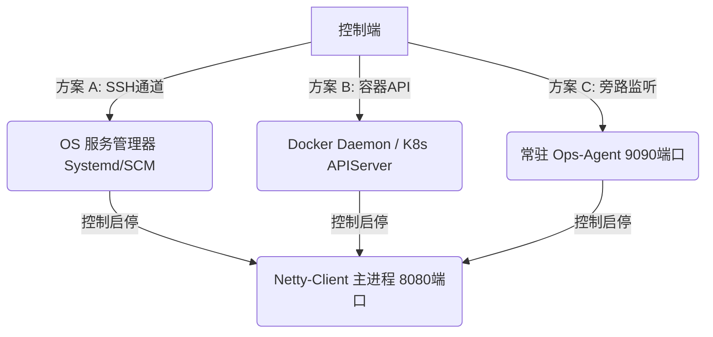

# 客户端更新与进程托管架构分析报告

本报告针对在 Windows/Linux 环境中运行的客户端程序（如 Netty 客户端），就如何实现**故障自动拉起**、**在线更新升级**、**免 SDK 远程 STS 下载**以及**远程启停控制**等架构设计问题进行深度分析与汇总。

---

## 目录
1. [免 OSS SDK 的本地 STS 签名方案](#1-免-oss-sdk-的本地-sts-签名方案)
2. [与引入 OSS SDK 方案的对比](#2-与引入-oss-sdk-方案的对比)
3. [OSS 与 Getdown 直接集成到主应用的可行性分析](#3-oss-与-getdown-直接集成到主应用的可行性分析)
4. [客户端守护进程的必要性评估](#4-客户端守护进程的必要性评估)
5. [机房/服务器环境下的进程守护方案](#5-机房服务器环境下的进程守护方案)
6. [远程启停控制的实现路径](#6-远程启停控制的实现路径)
7. [Windows 家庭桌面版的服务注册与 WinSW 方案](#7-windows-家庭桌面版的服务注册与-winsw-方案)
8. [行业商用软件实践参考](#8-行业商用软件实践参考)

---

## 1. 免 OSS SDK 的本地 STS 签名方案

### 1.1 核心设计思想
私有 OSS 桶要求每个文件的下载 URL 都包含针对该文件路径的独立签名（由于不同文件的 Object Key 不同，其对应的签名 URL 也不同）。
为了避免客户端在下载每个文件时都向后端发起一次签名请求（造成极高的网络开销和后端负载），可以采用 **“单次获取 STS 凭证 + 本地原生计算签名”** 的方案：
1. 客户端启动时，仅向后端服务器请求**一次** STS 临时访问凭证（包含 AccessKeyId, AccessKeySecret, SecurityToken）。
2. 本地代理拦截 Getdown 的下载请求，在内存中利用原生 Java JDK 算法（`javax.crypto.Mac` 和 `java.util.Base64`）实时计算签名，并返回 HTTP 302 重定向到 OSS。

### 1.2 原生 Java V1 预签名 URL 计算代码
```java
import javax.crypto.Mac;
import javax.crypto.spec.SecretKeySpec;
import java.net.URLEncoder;
import java.util.Base64;

public class OSSSigner {
    /**
     * 生成基于 STS 临时凭证的 OSS V1 预签名 URL
     */
    public static String generatePresignedUrl(
            String endpoint,         // 例如 "oss-cn-beijing.aliyuncs.com"
            String bucket,           // 例如 "tomin"
            String objectKey,        // 例如 "upgrade-dir/netty-client.jar"
            String accessKeyId,      // STS AccessKeyId
            String accessKeySecret,  // STS AccessKeySecret
            String securityToken,    // STS SecurityToken
            long expiresEpochSeconds // 过期时间戳（秒）
    ) throws Exception {

        String method = "GET";
        String contentMd5 = "";
        String contentType = "";

        // STS 的 security-token 在 V1 URL 签名中不计入 StringToSign 的 headers
        String canonicalHeaders = ""; 
        String canonicalResource = "/" + bucket + "/" + objectKey;

        String stringToSign = method + "\n"
                + contentMd5 + "\n"
                + contentType + "\n"
                + expiresEpochSeconds + "\n"
                + canonicalHeaders
                + canonicalResource;

        // 使用 AccessKeySecret 计算 HMAC-SHA1 签名
        Mac mac = Mac.getInstance("HmacSHA1");
        mac.init(new SecretKeySpec(accessKeySecret.getBytes("UTF-8"), "HmacSHA1"));
        byte[] signatureBytes = mac.doFinal(stringToSign.getBytes("UTF-8"));
        String signature = Base64.getEncoder().encodeToString(signatureBytes);

        // 拼接 Query 参数（必须包含 security-token）
        String queryString = "OSSAccessKeyId=" + URLEncoder.encode(accessKeyId, "UTF-8")
                + "&Expires=" + expiresEpochSeconds
                + "&Signature=" + URLEncoder.encode(signature, "UTF-8")
                + "&security-token=" + URLEncoder.encode(securityToken, "UTF-8");

        return "https://" + bucket + "." + endpoint + "/" + objectKey + "?" + queryString;
    }
}
```

### 1.3 原生 Java V4 预签名 URL 计算代码
如果安全审计要求更高，可使用原生 JDK 实现以下 V4 签名逻辑（同样零依赖）：
```java
import javax.crypto.Mac;
import javax.crypto.spec.SecretKeySpec;
import java.net.URLEncoder;
import java.nio.charset.StandardCharsets;
import java.text.SimpleDateFormat;
import java.util.*;

public class OSSV4Signer {

    private static byte[] hmacSHA256(byte[] key, String data) throws Exception {
        Mac mac = Mac.getInstance("HmacSHA256");
        mac.init(new SecretKeySpec(key, "HmacSHA256"));
        return mac.doFinal(data.getBytes(StandardCharsets.UTF_8));
    }

    private static String bytesToHex(byte[] bytes) {
        StringBuilder sb = new StringBuilder();
        for (byte b : bytes) {
            sb.append(String.format("%02x", b));
        }
        return sb.toString();
    }

    public static String generateV4PresignedUrl(
            String endpoint, String bucket, String objectKey,
            String accessKeyId, String accessKeySecret, String securityToken,
            String region, long expiresSeconds
    ) throws Exception {

        SimpleDateFormat sdfDate = new SimpleDateFormat("yyyyMMdd");
        SimpleDateFormat sdfDateTime = new SimpleDateFormat("yyyyMMdd'T'HHmmss'Z'");
        sdfDate.setTimeZone(TimeZone.getTimeZone("GMT"));
        sdfDateTime.setTimeZone(TimeZone.getTimeZone("GMT"));
        
        Date now = new Date();
        String dateStr = sdfDate.format(now);
        String dateTimeStr = sdfDateTime.format(now);

        String scope = dateStr + "/" + region + "/oss/aliyun_v4_request";
        String credential = accessKeyId + "/" + scope;

        Map<String, String> queryParams = new TreeMap<>();
        queryParams.put("x-oss-signature-version", "OSS4-HMAC-SHA256");
        queryParams.put("x-oss-credential", credential);
        queryParams.put("x-oss-date", dateTimeStr);
        queryParams.put("x-oss-expires", String.valueOf(expiresSeconds));
        queryParams.put("security-token", securityToken);

        StringBuilder canonicalQueryBuilder = new StringBuilder();
        for (Map.Entry<String, String> entry : queryParams.entrySet()) {
            if (canonicalQueryBuilder.length() > 0) canonicalQueryBuilder.append("&");
            canonicalQueryBuilder.append(URLEncoder.encode(entry.getKey(), "UTF-8"))
                    .append("=")
                    .append(URLEncoder.encode(entry.getValue(), "UTF-8"));
        }
        String canonicalQuery = canonicalQueryBuilder.toString();

        String method = "GET";
        String canonicalURI = "/" + bucket + "/" + objectKey;
        String canonicalHeaders = "host:" + bucket + "." + endpoint + "\n";
        String additionalHeaders = "host";
        String hashedPayload = "UNSIGNED-PAYLOAD";

        String canonicalRequest = method + "\n"
                + canonicalURI + "\n"
                + canonicalQuery + "\n"
                + canonicalHeaders + "\n"
                + additionalHeaders + "\n"
                + hashedPayload;

        java.security.MessageDigest digest = java.security.MessageDigest.getInstance("SHA-256");
        byte[] hashedReq = digest.digest(canonicalRequest.getBytes(StandardCharsets.UTF_8));
        String hashedReqHex = bytesToHex(hashedReq);

        String stringToSign = "OSS4-HMAC-SHA256\n"
                + dateTimeStr + "\n"
                + scope + "\n"
                + hashedReqHex;

        byte[] keySecret = ("aliyun_v4" + accessKeySecret).getBytes(StandardCharsets.UTF_8);
        byte[] keyDate = hmacSHA256(keySecret, dateStr);
        byte[] keyRegion = hmacSHA256(keyDate, region);
        byte[] keyService = hmacSHA256(keyRegion, "oss");
        byte[] signingKey = hmacSHA256(keyService, "aliyun_v4_request");

        byte[] signatureBytes = hmacSHA256(signingKey, stringToSign);
        String signature = bytesToHex(signatureBytes);

        return "https://" + bucket + "." + endpoint + "/" + objectKey + "?" + canonicalQuery + "&x-oss-signature=" + signature;
    }
}
```

---

## 2. 与引入 OSS SDK 方案的对比

| 对比维度 | 方案一：不引入 OSS SDK (原生 JDK 实现) | 方案二：引入 OSS SDK (`aliyun-sdk-oss`) |
| :--- | :--- | :--- |
| **安装包体积** | **极小（增加约 0 KB）**<br>保持 Launcher 的轻量化。 | **较大（增加 5MB - 10MB+）**<br>拉入大量传递依赖（HttpClient/Jackson等）。 |
| **启动性能** | **极快**<br>类加载少，无初始化开销。 | **略慢**<br>需要初始化 SDK 连接池等设施。 |
| **代码复杂度** | **中等**<br>需要本地编写几十行算法逻辑。 | **极低**<br>直接调用 SDK API。 |
| **后续维护成本** | **中等**<br>如果服务商签名协议发生断代变更，需要修改本地计算代码。 | **极低**<br>由云厂商通过 SDK 版本迭代提供透明兼容。 |

> [!TIP]
> **结论**：在自动更新引导器（Launcher）场景中，包体积至关重要，因此**强烈推荐使用原生 JDK 算法手动签名**，不引入完整 SDK。

---

## 3. OSS 与 Getdown 直接集成到主应用的可行性分析

### 3.1 瓶颈分析：JVM 文件锁 (File Locking)
在 JVM 运行期间，类加载器会对 classpath 下所有的 jar 包（如 `netty-client.jar`）加上强锁（尤其在 Windows 系统中）。
如果直接在主应用内部运行更新逻辑，去覆盖正在运行的 JAR 文件，操作系统会抛出进程占用/拒绝访问的错误。

### 3.2 变通设计：“单进程运行 + 系统服务托管” (推荐)
通过将文件覆盖推迟到“进程重启前的间隙”，可以实现无需常驻 Agent 的单进程更新：
1. 主应用运行期间，在后台静默将新 JAR 包下载到 `temp_upgrade/`。
2. 下载完毕，主应用调用 `System.exit(0)` 主动退出。
3. 托管服务的系统管理器（Systemd/Windows Service Wrapper）在拉起进程前，通过预备命令（`ExecStartPre` 或 `<prestart>`）将 `temp_upgrade/` 中的新包移动并覆盖到主运行目录。
4. 服务管理器启动新版主应用，完成升级闭环。

---

## 4. 客户端守护进程的必要性评估

对于普通桌面客户端或前台客户端软件，**常驻的守护进程（Daemon）绝对不是必须的**。
* 桌面软件应由用户控制生命周期（开则开，关则关），无故常驻后台不仅浪费用户资源，还极易被安全软件视作恶意程序。
* 异常拉起和更新替换完全可以交由操作系统服务（Systemd/Windows Service）来打理，无需自研守护进程。

---

## 5. 机房/服务器环境下的进程守护方案

在机房（Headless Server）中，进程守护（崩溃自愈、开机自启）是必须的。但最佳实践是**让操作系统或容器平台担任守护者，而不是自研守护软件**。

### 三大标准守护方案：
1. **Linux Systemd**：通过配置服务文件并设置 `Restart=always`，利用操作系统的 PID 1 进程进行绝对保活。
2. **Docker**：使用 `--restart=always` 参数，由 Docker 守护进程监控并自动拉起容器。
3. **Kubernetes**：通过 Deployment 声明期望状态，由 K8s 控制器在集群层面自动完成 Pod 漂移与自愈。

---

## 6. 远程启停控制的实现路径

当主应用被“远程停止”后，它无法再处理后续的“启动”指令。为此，远程控制启停必须通过以下三种常驻媒介之一来实现：



1. **方案 A（运维通道）**：控制端通过 SSH 调用宿主机的 `systemctl start/stop`。安全性高，零开发成本。
2. **方案 B（容器 API）**：控制端直接向 Docker API 发送容器启停请求。
3. **方案 C（旁路 Agent）**：在服务器上常驻一个极轻量的进程（Ops-Agent），单独监听一个端口。仅由该 Agent 接收启停命令，并在本地通过 `Runtime.getRuntime().exec` 操作主进程。

---

## 7. Windows 家庭桌面版的服务注册与 WinSW 方案

Windows 家庭版拥有与专业版完全一样的服务控制管理器（SCM）。我们可以使用 **WinSW** 极为方便地将 Java 程序包装为服务。

### 7.1 部署结构
```text
/install-path/
  ├── netty-client.jar    (主程序)
  ├── netty-client.exe    (WinSW 二进制文件，重命名)
  └── netty-client.xml    (服务配置文件)
```

### 7.2 配置文件示例 (`netty-client.xml`)
```xml
<service>
  <id>NettyClientService</id>
  <name>Netty Client Service</name>
  <description>This service runs the Netty Client Application.</description>
  
  <executable>java</executable>
  <arguments>-jar netty-client.jar</arguments>
  
  <startmode>Automatic</startmode>
  
  <!-- 崩溃 10 秒后自动重启 -->
  <onfailure action="restart" delay="10 sec"/>
  
  <!-- 启动前自动搬运更新包，避开文件锁 -->
  <prestart>cmd.exe /c move /y temp_upgrade\*.jar .\lib\</prestart>
  
  <log mode="roll-by-time">
    <pattern>yyyyMMdd</pattern>
  </log>
</service>
```

### 7.3 管理命令
在管理员命令行下执行：
* 安装服务：`netty-client.exe install`
* 启动服务：`netty-client.exe start`
* 停止服务：`netty-client.exe stop`
* 卸载服务：`netty-client.exe uninstall`

---

## 8. 行业商用软件实践参考

上述提到的各种技术组件与流程设计，均在主流商用及开源产品中得到了长期的生产验证：

* **WinSW 服务托管**：
  * **Jenkins** 官方的 Windows 安装包直接内置并使用 WinSW 将自身注册为 Windows 服务。
  * **Gitea** 官方推荐并使用 WinSW 进行 Windows 生产环境部署。
* **“下载至暂存 -> 退出 -> 外部重载更新”流**：
  * **VS Code** 在退出时拉起极其轻量级的 `inno_updater.exe` 来执行安装目录文件替换。
  * **IntelliJ IDEA / JetBrains 全家桶** 在重启时启动一个几 KB 的 `patch-launcher.jar` 来应用补丁并重启 IDE。
  * **Chrome/Firefox** 在关闭浏览器时的瞬间，由更新模块完成暂存区到运行目录的替换。
