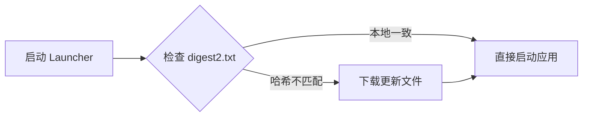
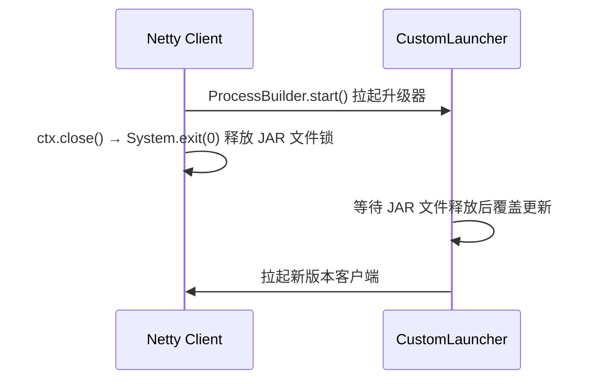
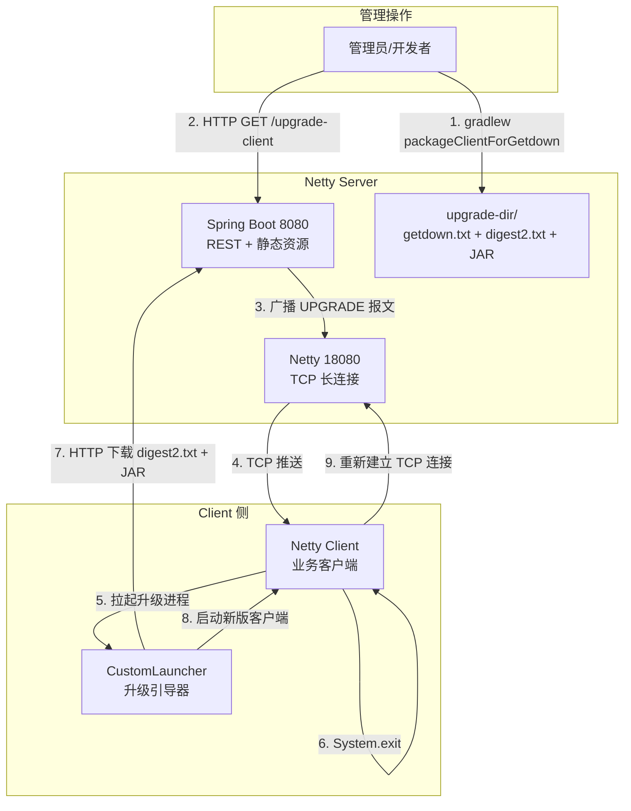

# Getdown 升级管理工具 — 功能、性能、可靠性与安全性分析

本文档系统性地梳理 **Getdown** 框架的核心能力，并结合本项目（`nettydemo`）的实际实现进行说明。

---

## 一、Getdown 概述

**Getdown** 是一个开源的 Java 应用部署与自动更新框架，最初由 Three Rings Design 开发，作为 **Java Web Start (JWS)** 的替代方案。它已在 *Puzzle Pirates*、*Spiral Knights* 等大型在线游戏中得到生产验证。

| 属性 | 说明 |
|------|------|
| 开源协议 | BSD License |
| Maven 坐标 | `com.threerings.getdown:getdown-launcher:1.8.6` |
| 最小 JDK | Java 7+（本项目使用 Java 8） |
| 核心架构 | Launcher + Core + Build Tools 三模块 |

---

## 二、主要功能

### 1. 自动更新（Auto Update）

Getdown 的核心能力是 **启动前自动检测并应用更新**。



**本项目实现**：
- [CustomLauncher.java](file:///d:/Projects/code/nettydemo/netty-client-upgrade/src/main/java/com/example/netty/upgrade/CustomLauncher.java) 调用 `GetdownApp.main()` 启动更新检查
- 服务端通过 [UpgradeController.java](file:///d:/Projects/code/nettydemo/netty-server/src/main/java/com/example/netty/server/controller/UpgradeController.java) 广播 `UPGRADE` 指令触发更新流程

### 2. 配置驱动部署（Configuration-Driven）

所有部署行为通过 `getdown.txt` 声明式配置，无需硬编码：

| 配置项 | 含义 | 本项目取值 |
|--------|------|-----------|
| `appbase` | 远程资源基础 URL | `http://localhost:8080/upgrade` |
| `class` | 应用入口类 | `org.springframework.boot.loader.JarLauncher` |
| `code` | 需管理的应用 JAR | `netty-client.jar` |
| `jvmarg` | JVM 启动参数 | `-Dfile.encoding=UTF-8` |

> [!TIP]
> Getdown 还支持更多高级配置：`resource`（额外资源文件）、`uresource`（免校验资源）、`nresource`（本地库）、`java_min_version`（JDK 版本约束）、`ui.background_image`（启动界面背景）等。

### 3. 文件完整性校验（Digest Verification）

Getdown 使用 **SHA-256 摘要文件** (`digest2.txt`) 对所有托管文件进行完整性校验：

```
# digest2.txt 示例
netty-client.jar = 5f91005ad06e7cee371261c0a987cf6908c3eee1363862ee2958ecd951008d31
```

**本项目实现**：
- [build.gradle](file:///d:/Projects/code/nettydemo/netty-client-upgrade/build.gradle#L51-L61) 中的 `packageClientForGetdown` 任务自动计算 SHA-256 并生成 `digest2.txt`
- Launcher 启动时从服务端拉取 `digest2.txt`，与本地文件比对哈希，决定是否需要下载

### 4. 无 GUI 模式（Headless Mode）

Getdown 同时支持 **Swing GUI 模式**（显示下载进度条）和 **无头模式**（服务端/后台场景）：

```java
// CustomLauncher.java:38
System.setProperty("no_gui", "true");
```

### 5. 引导程序自举（Bootstrap）

Launcher 具备自举能力——当目标目录中不存在 `getdown.txt` 时，自动生成初始配置：

```java
// CustomLauncher.java:24-34
if (!getdownTxt.exists()) {
    // 自动创建初始 getdown.txt 配置
}
```

### 6. 静态资源托管

服务端通过 Spring Boot 静态资源映射，将 `upgrade-dir/` 目录暴露为 HTTP 服务：

```java
// WebConfig.java:24-28
registry.addResourceHandler("/upgrade/**")
        .addResourceLocations("file:" + dir.getAbsolutePath() + "/");
```

---

## 三、性能设计

| 性能特性 | 说明 | 本项目体现 |
|---------|------|-----------|
| **增量更新** | 仅下载哈希不匹配的文件，跳过未变更文件 | `digest2.txt` 比对，仅 `netty-client.jar` 发生变化时才下载 |
| **本地缓存** | 已下载文件持久化到本地 `client-run-dir/`，避免重复下载 | [CustomLauncher.java:17](file:///d:/Projects/code/nettydemo/netty-client-upgrade/src/main/java/com/example/netty/upgrade/CustomLauncher.java#L17) 中的本地目录机制 |
| **轻量级协议** | 基于标准 HTTP GET 请求，无需复杂协议，兼容 CDN 和反向代理 | 通过 Spring Boot 静态资源 handler 直接提供文件 |
| **最小化下载** | 配置文件 (`getdown.txt`, `digest2.txt`) 极小（~100 bytes），校验极快 | `getdown.txt` 仅 147 bytes, `digest2.txt` 仅 84 bytes |
| **异步进程** | 升级器作为独立进程启动，不阻塞主应用 | [ClientHandler.java:75-84](file:///d:/Projects/code/nettydemo/netty-client/src/main/java/com/example/netty/client/handler/ClientHandler.java#L75-L84) 使用 `ProcessBuilder` 异步拉起 |

> [!NOTE]
> Getdown 原生支持 **多资源并行下载**，对于包含多个 JAR 和资源文件的大型应用，下载速度可显著提升。本项目目前仅管理单个 `netty-client.jar`，暂未触发此特性。

---

## 四、可靠性设计

### 1. 原子文件操作

Getdown 下载文件时使用 **临时文件 + 重命名** 策略：
1. 将新文件下载到临时位置（`.tmp` 后缀）
2. 下载完成并校验成功后，原子性地替换旧文件
3. 避免下载中途失败导致文件损坏

### 2. 进程隔离与文件释放



**本项目实现**（[ClientHandler.java:87-89](file:///d:/Projects/code/nettydemo/netty-client/src/main/java/com/example/netty/client/handler/ClientHandler.java#L87-L89)）：
```java
ctx.close().addListener(f -> {
    System.exit(0);  // 确保 JAR 文件不再被占用
});
```

> [!IMPORTANT]
> 在 Windows 系统上，运行中的 JAR 文件会被系统锁定。必须先终止客户端进程、释放文件锁，升级器才能覆盖 JAR。本项目通过 `System.exit(0)` 实现此设计。

### 3. 失败重试

Getdown 内置 HTTP 下载失败重试机制：
- 网络中断后自动重试下载
- 可配置最大重试次数
- 部分下载支持断点续传

### 4. 版本回退能力

- 通过回退服务端 `upgrade-dir/` 中的文件并重新生成 `digest2.txt`，即可实现版本回退
- Launcher 下次启动时会检测到哈希差异，自动拉取"旧版本"实现降级

### 5. Protobuf 升级指令可靠传输

升级触发通过 **Netty TCP 长连接 + Protobuf** 传输，而非 HTTP 轮询：

| 特性 | 说明 |
|------|------|
| 可靠传输 | TCP 保证消息有序、不丢失 |
| 心跳保活 | 客户端定期发送 Ping，确保连接存活 |
| 实时推送 | 服务端主动推送升级指令，无需客户端轮询 |
| 广播能力 | [ServerHandler.activeChannels](file:///d:/Projects/code/nettydemo/netty-server/src/main/java/com/example/netty/server/controller/UpgradeController.java#L33-L34) 可同时向所有在线客户端推送 |

---

## 五、安全性设计

### 1. SHA-256 哈希校验

| 安全层 | 机制 |
|--------|------|
| **完整性** | 每个受管文件在 `digest2.txt` 中记录 SHA-256 哈希值 |
| **篡改检测** | Launcher 下载文件后重新计算哈希并与 `digest2.txt` 比对，不一致则拒绝使用 |
| **校验时机** | 每次启动/升级时都执行校验，非一次性检查 |

```java
// build.gradle:64-69 — 哈希生成
def getSHA256(File file) {
    def digest = java.security.MessageDigest.getInstance("SHA-256")
    file.eachByte(4096) { buffer, length ->
        digest.update(buffer, 0, length)
    }
    return digest.digest().encodeHex().toString()
}
```

### 2. 签名摘要文件（Signed Digest）

Getdown 支持对 `digest2.txt` 文件进行 **数字签名**：
- 使用开发者私钥对摘要文件签名
- Launcher 使用内嵌的公钥验证签名
- 防止中间人攻击篡改 `digest2.txt` 和文件内容

> [!WARNING]
> 本项目当前 **未启用** digest 签名机制。在生产环境中，建议配置 `getdown.txt` 中的 `digest_signature` 参数并使用密钥对签名，防止 MITM 攻击。

### 3. 进程隔离

升级器与客户端运行在 **独立进程** 中，具有天然的进程级隔离：

| 隔离特性 | 说明 |
|---------|------|
| 独立 JVM | 升级器和客户端各运行在独立 JVM 进程中 |
| 权限隔离 | 升级器仅操作 `client-run-dir/` 目录，不影响其他系统资源 |
| 失败隔离 | 升级器崩溃不影响已运行的客户端（客户端此时已退出） |

### 4. 传输安全

| 维度 | 当前状态 | 生产建议 |
|------|---------|---------|
| 应用下载 | HTTP（明文） | 升级为 **HTTPS**，防止传输层劫持 |
| 升级指令 | TCP（Protobuf，无 TLS） | 添加 **TLS/SSL** 加密 Netty 通道 |
| 管理接口 | HTTP GET（无认证） | 添加 **Token/鉴权** 保护 `/upgrade-client` 接口 |

> [!CAUTION]
> 当前 `/upgrade-client` 接口没有任何认证机制，任何能访问该端口的人都可以触发全量客户端升级。生产环境务必添加鉴权（如 API Key、JWT 或 Spring Security）。

---

## 六、架构总览



---

## 七、总结与建议

### ✅ 当前优势

| 方面 | 评价 |
|------|------|
| **功能完整性** | 覆盖了"触发 → 下载 → 校验 → 替换 → 重启"全流程 |
| **性能** | 增量下载 + 轻量协议，更新速度快 |
| **可靠性** | 进程隔离 + 文件释放 + TCP 可靠传输 |
| **可维护性** | 配置驱动、Gradle 一键打包 |

### ⚠️ 生产化建议

| 优先级 | 建议 |
|--------|------|
| 🔴 高 | 启用 digest 签名机制，防止 MITM 攻击 |
| 🔴 高 | `/upgrade-client` 接口添加鉴权 |
| 🟡 中 | 升级 HTTP 为 HTTPS |
| 🟡 中 | Netty TCP 通道添加 TLS 加密 |
| 🟢 低 | 添加版本号管理与升级历史日志 |
| 🟢 低 | 支持灰度/分批升级，避免全量同时升级导致服务中断 |
