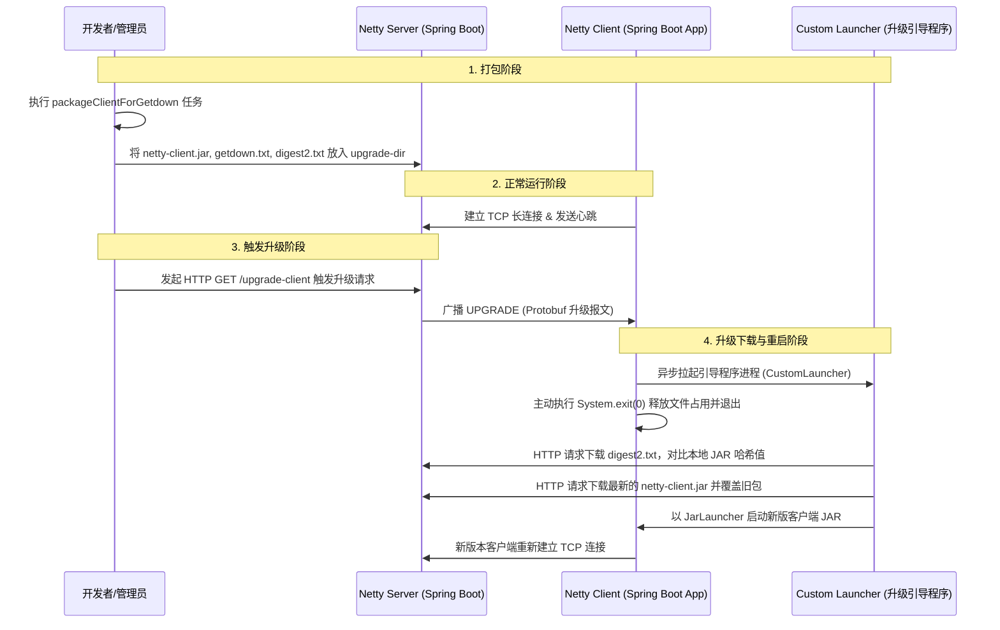

# Netty Client Upgrade 模块打包与在线升级使用指南

本项目包含一个基于 **Getdown** 升级框架的在线升级方案。该方案能够实现在服务端触发升级后，客户端自动拉起升级引导程序（`CustomLauncher`），释放原客户端进程占用的 JAR 包，比对哈希、下载更新并重新拉起最新版本客户端。

---

## 一、 升级机制与架构



### 1. 核心目录与配置

* **`upgrade-dir`**：位于项目根目录下，存放可供客户端下载的更新包（`netty-client.jar`）以及 Getdown 配置文件（`getdown.txt`、`digest2.txt`）。
* **`/upgrade/**` 路由映射**：在 `netty-server` 模块的 [WebConfig.java](file:///d:/Projects/code/nettydemo/netty-server/src/main/java/com/example/netty/server/config/WebConfig.java) 中，配置了将该接口映射为本地 `upgrade-dir` 静态目录，使得客户端可通过 `http://localhost:8080/upgrade/` 协议下载更新。

---

## 二、 打包与升级步骤

### 第一步：打包最新客户端到升级目录

在项目根目录下，使用 Gradle 任务进行打包：

```powershell
# 1. 编译客户端并将 JAR 包、getdown.txt、哈希校验文件 digest2.txt 输出到 upgrade-dir/ 目录下
.\gradlew :netty-client-upgrade:packageClientForGetdown

# 2. 编译打包 upgrade 升级引导程序本身
.\gradlew :netty-client-upgrade:jar
```

### 第二步：启动 Netty Server

启动服务端程序以托管静态升级资源并监听客户端 TCP 链接：

```powershell
.\gradlew :netty-server:bootRun
```

* 服务端会在 `18080` 端口监听 Netty 客户端连接。
* 在 `8080` 端口提供 RESTful 接口与托管更新静态文件目录（如：`http://localhost:8080/upgrade/getdown.txt`）。

### 第三步：运行引导程序启动客户端（模拟真实环境）

在真实环境中，客户端是通过启动升级引导器（`CustomLauncher`）来拉起的，从而保证客户端随时处于可在线升级状态。

运行以下命令拉起引导器：

```powershell
java -cp d:/Projects/code/nettydemo/netty-client-upgrade/build/libs/netty-client-upgrade-1.0.0.jar com.example.netty.upgrade.CustomLauncher
```

**引导器运行细节**：

1. 会在执行目录下创建 `client-run-dir` 目录。
2. 检测到 `client-run-dir` 中无可用配置时，自动生成引导配置文件。
3. 从服务器 `http://localhost:8080/upgrade/` 下载最新的 `netty-client.jar` 和哈希校验码。
4. 下载完毕后自动拉起客户端进程，客户端与服务端建立长连接。

---

## 三、 测试在线升级流程

### 1. 修改客户端代码，生成“新版本”

1. 修改 `netty-client` 模块中的任何代码（例如：修改控制台输出、业务交互逻辑或日志输出）。
2. 在项目根目录重新执行打包命令，覆盖升级目录下的文件并生成新的哈希校验值：

   ```powershell
   .\gradlew :netty-client-upgrade:packageClientForGetdown
   ```

### 2. 发起 API 请求触发客户端热更新

向服务端发送 HTTP 请求，向连接中的所有客户端广播升级指令：

```powershell
# 使用 curl 或者直接在浏览器中访问该 URL
curl "http://localhost:8080/upgrade-client?version=1.0.1"
```

**系统反应流程**：

1. **服务端广播**：服务端向当前在线的 Netty 客户端发送 `MessageType.UPGRADE` 报文。
2. **客户端接收并拉起升级**：客户端接收到升级指令后，通过命令行拉起独立的升级器子进程 `CustomLauncher`。
3. **客户端自杀**：客户端连接关闭，并立即调用 `System.exit(0)` 退出，此时本地运行的 `netty-client.jar` 不再被系统锁定。
4. **升级器更新并拉起新版**：升级器 `CustomLauncher` 启动后自动连网与服务端比对哈希值，检测到文件改变后自动下载新的 `netty-client.jar` 并覆盖本地文件，最后重新拉起客户端。
5. **客户端重连**：新版本客户端成功启动，重新连上服务端，热更新完成。
