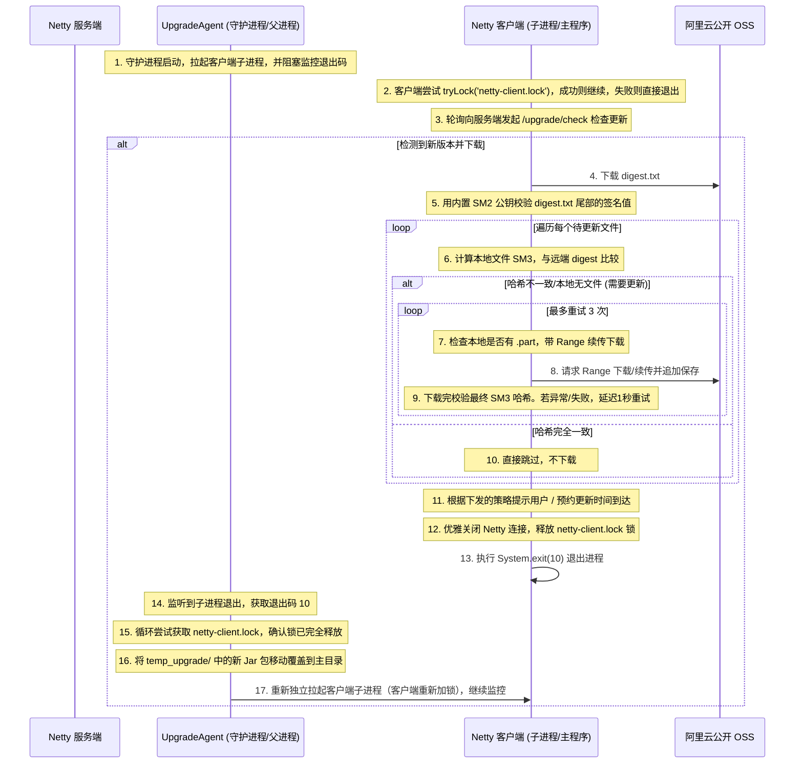

# 国密 SM2/SM3 签名与父子进程协同（退出码驱动）更新方案

根据您的反馈，我们在方案中加入了 **并发运行锁定锁（单例模式）**，利用独占文件锁实现“双重防冲突保护”。

---

## 稳定性与安全性参考设计（增量下载、重试、单例锁与断点续传）

### 1. 稳定性保障与高效传输机制
- **并发运行锁定锁（单例模式防重复启动）**：
  - 在客户端运行目录下引入一个锁定文件 `netty-client.lock`。
  - **客户端防重开**：客户端 `netty-client` 启动时，使用 Java NIO `FileChannel.tryLock()` 尝试对该文件加**独占锁**。如果加锁失败，说明系统已有另一个客户端实例在运行，程序会打印“已有客户端实例在运行中”的日志并直接退出（`System.exit(0)`）。
  - **安全覆盖检测**：由于操作系统在 JVM 进程退出时会自动释放文件锁，守护进程 `UpgradeAgent` 在执行更新时，可以通过尝试获取 `netty-client.lock` 的独占锁来判定客户端进程是否已完全释放资源退出。这提供了一种高安全性、跨平台的“无锁冲突”检测机制。
- **增量下载（按需下载）**：
  - 在开始任何文件下载之前，客户端会计算本地对应文件的 **SM3 哈希值**，并与远端已签名的 `digest.txt` 进行比对。如果一致，则**直接跳过下载**，实现增量升级。
- **异常重试 3 次**：
  - 对于每一个需要下载/续传的文件，若产生任何异常（如 `IOException`、SM3 哈希校验未通过等），客户端记录警告并延迟 1 秒自动重试，最多重试 3 次。
- **基于 HTTP Range 头部的“断点续传”**：
  - 配合重试与断点续传：若下载在中途断开，客户端会检测已存在的 `.part` 临时文件，发送 `Range: bytes=X-` 请求头，在上次中断的位置上进行追加下载。下载完成后重命名为真实文件名并执行最终的 SM3 校验。
- **离线/失败回退机制**：
  - 若版本检查 API 请求失败，记录 Warning 日志，自动降级回退到运行本地现有版本，保证高可用。

### 2. 安全性保障（参考 Getdown 数字签名防篡改）
- **国密 SM2 签名验证防御中间人（MITM）攻击**：
  - 编译打包时使用 SM2 私钥对 `digest.txt` 进行签名，并将签名附加到最后一行（`signature = <sm2_hex>`）。
  - 客户端下载 `digest.txt` 后，首先用内置的 SM2 公钥校验其签名完整性。若验证失败，立即终止更新并清除缓存。

---

## 升级交互与生命周期设计

---

## 拟作出的修改

### 1. [netty-server](file:///d:/Projects/code/nettydemo/netty-server) 模块

#### [修改] [UpgradeController.java](file:///d:/Projects/code/nettydemo/netty-server/src/main/java/com/example/netty/server/controller/UpgradeController.java)
- 新增 `/upgrade/check` 接口，比对版本信息与策略设置，返回包含更新状态、下载地址、策略、强更标识的 JSON。

---

### 2. [netty-client](file:///d:/Projects/code/nettydemo/netty-client) 模块

#### [修改] [build.gradle](file:///d:/Projects/code/nettydemo/netty-client/build.gradle)
- 引入 Hutool 依赖：`implementation 'cn.hutool:hutool-crypto:5.8.25'`。
- 新增打包生成任务 `packageClientForGetdown`，复制文件到目标目录并运行 `Digester.java` 生成 SM3 摘要和 SM2 签名。

#### [新增] [Digester.java](file:///d:/Projects/code/nettydemo/netty-client/src/main/java/com/example/netty/client/tools/Digester.java)
- 构建期摘要生成与签名工具。使用 **SM3 算法** 计算每个文件的哈希值并签名，最后在 `digest.txt` 尾部附加 `signature = <sm2_hex>`，生成 `version.txt` 元数据。

#### [修改] [NettyClientApplication.java](file:///d:/Projects/code/nettydemo/netty-client/src/main/java/com/example/netty/client/NettyClientApplication.java)
- 在 `run` 方法入口处（或 Spring 启动前），使用 `RandomAccessFile` 独占锁定 `netty-client.lock` 文件。
- 若锁定失败，表示已有实例在运行，直接退出，达到单例锁防重复运行效果。
- 注册 JVM 关闭钩子（Shutdown Hook），或在应用正常停止时显式释放文件锁。

#### [新增] [UpgradeService.java](file:///d:/Projects/code/nettydemo/netty-client/src/main/java/com/example/netty/client/core/UpgradeService.java)
- 核心基础服务类。
- 定期或启动时调用 `/upgrade/check`。若失败，日志报警并执行离线降级回退。
- **增量下载、断点续传与 3 次重试**：
  - 下载并验证 `digest.txt` 的 SM2 签名。
  - 比对本地文件与 `digest.txt` 各项的 SM3，过滤无需下载文件。
  - 对于需下载文件，基于 `.part` 进行 Range 续传并伴随 3 次异常重试，下载完成后比对 SM3。
- **优雅停机与退出**：
  - 到达预约时间，优雅释放 Netty 物理通道和线程资源，并调用 `System.exit(10)`。

#### [修改] [ClientHandler.java](file:///d:/Projects/code/nettydemo/netty-client/src/main/java/com/example/netty/client/handler/ClientHandler.java) 与 [NettyClient.java](file:///d:/Projects/code/nettydemo/netty-client/src/main/java/com/example/netty/client/core/NettyClient.java)
- 整合 `UpgradeService` 拦截并处理 `MessageType.UPGRADE` 升级请求。

#### [删除] [UpgradeClientPlugin.java](file:///d:/Projects/code/nettydemo/netty-client/src/main/java/com/example/netty/client/plugin/UpgradeClientPlugin.java)

---

### 3. [netty-client-upgrade](file:///d:/Projects/code/nettydemo/netty-client-upgrade) 模块

#### [新增] [UpgradeAgent.java](file:///d:/Projects/code/nettydemo/netty-client-upgrade/src/main/java/com/example/netty/upgrade/UpgradeAgent.java) (替代 CustomLauncher.java)
- 常驻后台守护进程。通过 `ProcessBuilder` 拉起客户端子进程，监控其退出码。
- **退出码 10（请求更新）**：
  - **基于 netty-client.lock 的安全覆盖校验**：守护进程循环尝试锁定 `netty-client.lock` 文件（最多重试 10 次，每次 500ms）。只有成功锁定，说明客户端 JVM 已经彻底释放锁并退役。
  - 将 `temp_upgrade/` 中的新包复制覆盖到主目录。
  - 清理旧 JAR，重新独立拉起子进程（子进程将再次尝试对 lock 文件加锁并持续运行）。
- **非 0 且非 10 退出码（崩溃）**：
  - 挂起等待 5 秒后自动重新拉起客户端（崩溃自愈）。

#### [删除] [CustomLauncher.java](file:///d:/Projects/code/nettydemo/netty-client-upgrade/src/main/java/com/example/netty/upgrade/CustomLauncher.java)

---

## 验证计划

### 1. 单例锁（防多开）验证
- 启动一个客户端进程。
- 尝试启动第二个客户端进程，验证第二个客户端是否能够检测到锁并提示“已有客户端实例在运行中”而直接秒退，确保单例正常。

### 2. 覆盖升级安全性验证
- 触发升级。验证子进程退出后，守护进程能够成功获取 `netty-client.lock`，并无冲突地完成包文件替换，重启拉起新客户端。
