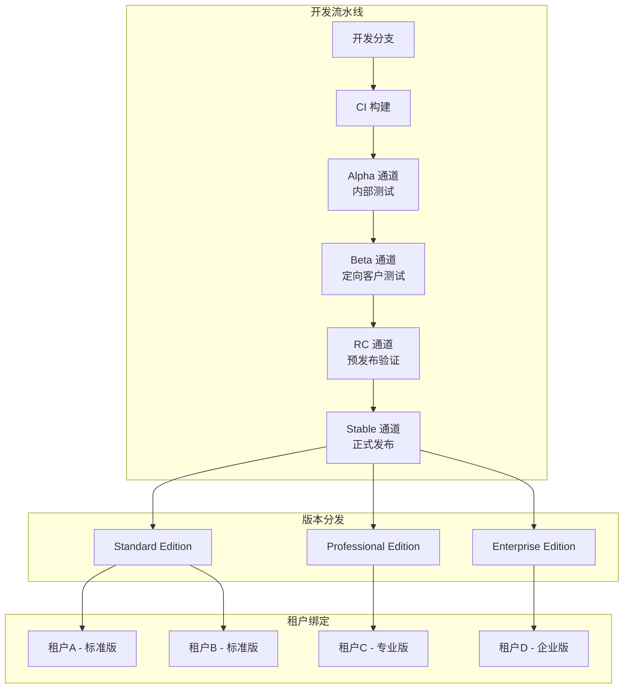
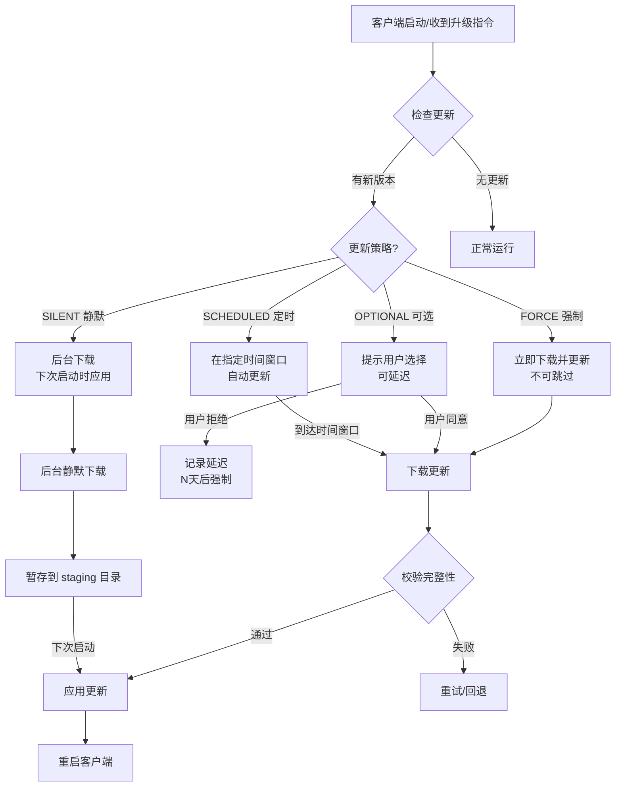
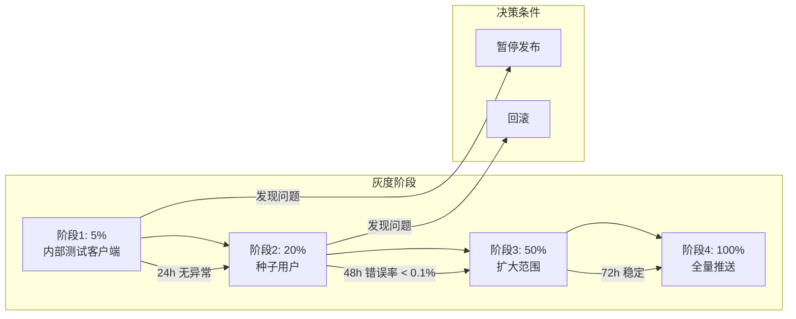
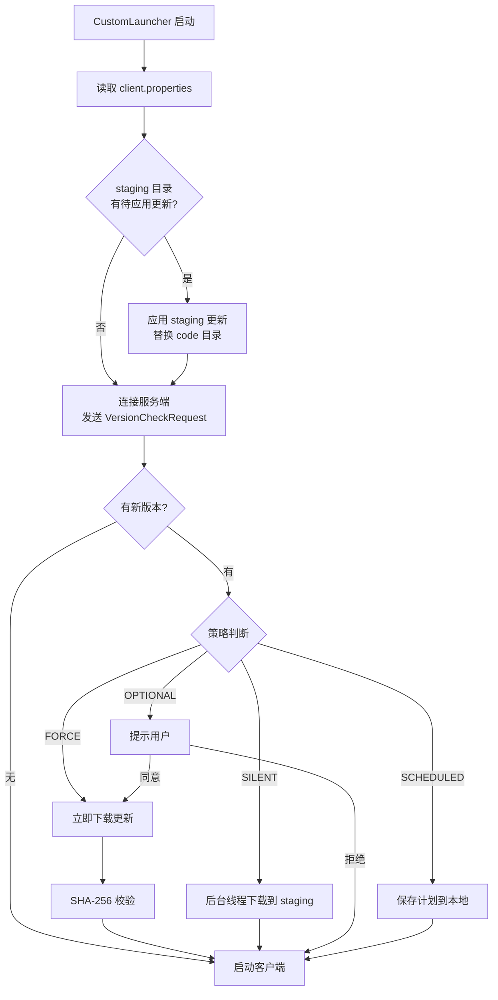
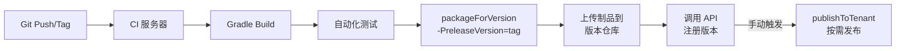
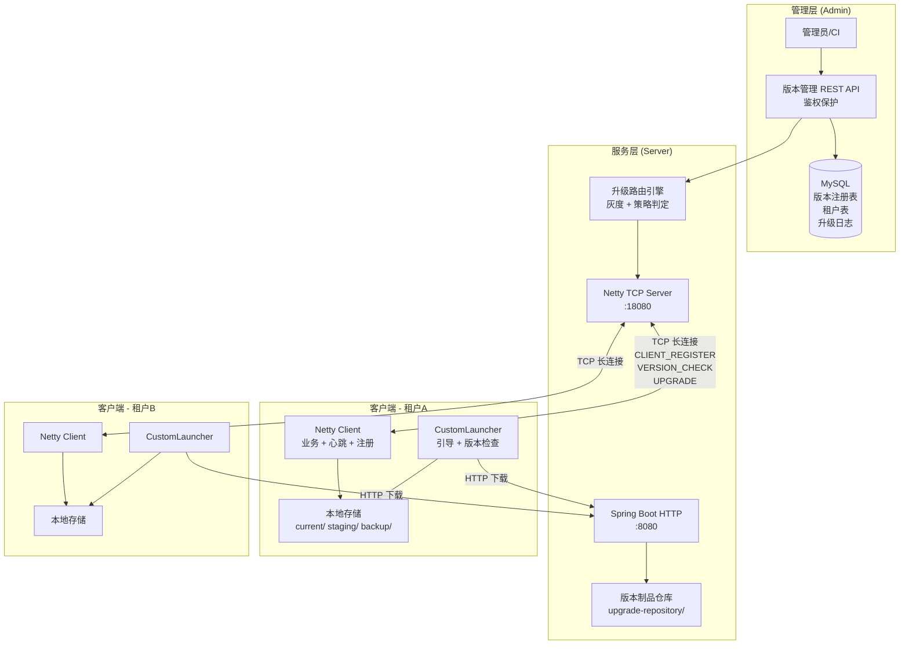

# 商业软件客户端版本管理体系与按需发布更新策略设计

基于现有 `nettydemo` 项目的 Getdown 升级框架，设计一套支持**定制版客户**、**按需发布**、**灰度更新**的完整版本管理与更新策略体系。

---

## 一、现状分析

### 当前架构能力

| 能力 | 现状 | 局限 |
|------|------|------|
| 版本标识 | URL 参数传入 `version` 字符串，无持久化 | 无版本注册中心，无法回溯历史 |
| 发布通道 | 单一 `upgrade-dir/` 目录，全量广播 | 无法区分客户、无法灰度 |
| 更新触发 | `GET /upgrade-client?version=x` 一键全量推送 | 无鉴权、无目标选择、无策略 |
| 定制客户 | 不支持 | 所有客户端共用同一套代码和配置 |
| 回滚能力 | 手动替换 `upgrade-dir` 文件 | 无自动回滚、无版本快照 |

### 核心文件引用

- [message.proto](file:///d:/Projects/code/nettydemo/netty-common/src/main/proto/message.proto) — 当前 Protobuf 协议定义
- [UpgradeController.java](file:///d:/Projects/code/nettydemo/netty-server/src/main/java/com/example/netty/server/controller/UpgradeController.java) — 服务端升级触发 API
- [UpgradeClientPlugin.java](file:///d:/Projects/code/nettydemo/netty-client/src/main/java/com/example/netty/client/plugin/UpgradeClientPlugin.java) — 客户端升级处理插件
- [CustomLauncher.java](file:///d:/Projects/code/nettydemo/netty-client-upgrade/src/main/java/com/example/netty/upgrade/CustomLauncher.java) — Getdown 启动引导器
- [build.gradle (upgrade)](file:///d:/Projects/code/nettydemo/netty-client-upgrade/build.gradle) — Getdown 打包任务

---

## 二、版本号体系设计

### 2.1 版本号规范

采用 **语义化版本 + 构建元数据** 的四段式版本号：

```
{major}.{minor}.{patch}-{channel}+{buildNumber}
```

| 段 | 含义 | 示例 |
|----|------|------|
| `major` | 主版本，不兼容的架构变更 | `2` |
| `minor` | 次版本，向下兼容的功能新增 | `3` |
| `patch` | 补丁版本，Bug 修复 | `1` |
| `channel` | 发布通道标识（可选） | `beta`, `rc`, `stable` |
| `buildNumber` | CI 构建序号（可选元数据） | `+20260602001` |

**完整版本号示例**：`2.3.1-stable+20260602001`

### 2.2 版本比较规则

```
major > minor > patch > channel权重(stable=3, rc=2, beta=1, alpha=0) > buildNumber
```

### 2.3 版本注册表结构（数据库）

```sql
CREATE TABLE client_version (
    id              BIGINT PRIMARY KEY AUTO_INCREMENT,
    version         VARCHAR(50)  NOT NULL UNIQUE,  -- '2.3.1-stable'
    major           INT          NOT NULL,
    minor           INT          NOT NULL,
    patch           INT          NOT NULL,
    channel         VARCHAR(20)  NOT NULL DEFAULT 'stable',  -- alpha/beta/rc/stable
    build_number    VARCHAR(30),                    -- CI 构建号
    artifact_path   VARCHAR(500) NOT NULL,          -- 制品存储路径
    artifact_hash   VARCHAR(64)  NOT NULL,          -- SHA-256 哈希
    artifact_size   BIGINT       NOT NULL,          -- 文件大小 (bytes)
    release_notes   TEXT,                           -- 更新说明
    min_jdk_version VARCHAR(10)  DEFAULT '1.8',     -- 最低 JDK 要求
    status          VARCHAR(20)  NOT NULL DEFAULT 'DRAFT',  -- DRAFT/PUBLISHED/DEPRECATED/RECALLED
    created_at      DATETIME     NOT NULL DEFAULT CURRENT_TIMESTAMP,
    published_at    DATETIME,
    created_by      VARCHAR(50),
    INDEX idx_version_channel (channel, status),
    INDEX idx_version_status (status, published_at)
);
```

---

## 三、定制客户（Tenant）模型设计

### 3.1 租户体系

为每个定制版客户创建独立的发布通道：

```sql
CREATE TABLE tenant (
    id              BIGINT PRIMARY KEY AUTO_INCREMENT,
    tenant_code     VARCHAR(50)  NOT NULL UNIQUE,   -- 租户编码 'CUSTOMER_A'
    tenant_name     VARCHAR(100) NOT NULL,          -- 租户名称 '甲方公司A'
    edition         VARCHAR(50)  NOT NULL DEFAULT 'STANDARD',  -- STANDARD/PROFESSIONAL/ENTERPRISE
    status          VARCHAR(20)  NOT NULL DEFAULT 'ACTIVE',
    config_json     TEXT,                           -- 租户定制配置 JSON
    created_at      DATETIME     NOT NULL DEFAULT CURRENT_TIMESTAMP,
    INDEX idx_tenant_edition (edition)
);
```

### 3.2 租户版本绑定

通过绑定表控制每个租户可获取的版本：

```sql
CREATE TABLE tenant_version_binding (
    id              BIGINT PRIMARY KEY AUTO_INCREMENT,
    tenant_id       BIGINT       NOT NULL,
    version_id      BIGINT       NOT NULL,
    update_strategy VARCHAR(20)  NOT NULL DEFAULT 'OPTIONAL',  -- FORCE/OPTIONAL/SILENT
    rollout_percent INT          NOT NULL DEFAULT 100,          -- 灰度百分比 0-100
    priority        INT          NOT NULL DEFAULT 0,            -- 推送优先级
    effective_from  DATETIME,                                   -- 生效开始时间
    effective_to    DATETIME,                                   -- 生效结束时间（可选）
    status          VARCHAR(20)  NOT NULL DEFAULT 'ACTIVE',     -- ACTIVE/PAUSED/COMPLETED
    created_at      DATETIME     NOT NULL DEFAULT CURRENT_TIMESTAMP,
    FOREIGN KEY (tenant_id) REFERENCES tenant(id),
    FOREIGN KEY (version_id) REFERENCES client_version(id),
    UNIQUE KEY uk_tenant_version (tenant_id, version_id)
);
```

### 3.3 客户端实例注册

```sql
CREATE TABLE client_instance (
    id              BIGINT PRIMARY KEY AUTO_INCREMENT,
    client_id       VARCHAR(64)  NOT NULL UNIQUE,   -- 客户端唯一标识 (UUID)
    tenant_id       BIGINT       NOT NULL,
    current_version VARCHAR(50)  NOT NULL,           -- 当前运行版本
    os_type         VARCHAR(20),                     -- WINDOWS/LINUX/MAC
    os_version      VARCHAR(50),
    jdk_version     VARCHAR(20),
    machine_id      VARCHAR(100),                    -- 机器指纹
    last_heartbeat  DATETIME,
    last_upgrade_at DATETIME,
    status          VARCHAR(20)  DEFAULT 'ONLINE',   -- ONLINE/OFFLINE
    created_at      DATETIME     NOT NULL DEFAULT CURRENT_TIMESTAMP,
    FOREIGN KEY (tenant_id) REFERENCES tenant(id),
    INDEX idx_client_tenant (tenant_id, status),
    INDEX idx_client_version (current_version)
);
```

### 3.4 升级记录审计

```sql
CREATE TABLE upgrade_log (
    id              BIGINT PRIMARY KEY AUTO_INCREMENT,
    client_id       VARCHAR(64)  NOT NULL,
    tenant_id       BIGINT       NOT NULL,
    from_version    VARCHAR(50)  NOT NULL,
    to_version      VARCHAR(50)  NOT NULL,
    strategy        VARCHAR(20)  NOT NULL,           -- FORCE/OPTIONAL/SILENT
    result          VARCHAR(20)  NOT NULL,           -- SUCCESS/FAILED/SKIPPED/ROLLBACK
    error_message   TEXT,
    started_at      DATETIME     NOT NULL,
    completed_at    DATETIME,
    INDEX idx_log_client (client_id, started_at),
    INDEX idx_log_tenant (tenant_id, result)
);
```

---

## 四、发布通道与多 Edition 架构

### 4.1 发布通道模型



### 4.2 Edition（版本类型）差异化

| Edition | 特性 | 更新策略 |
|---------|------|---------|
| **Standard** | 基础功能，统一配置 | 自动更新，无灰度 |
| **Professional** | 增强功能，可定制插件 | 可选更新，支持灰度 |
| **Enterprise** | 全功能，私有化部署，自定义 UI/品牌 | 手动确认更新，支持回滚 |

### 4.3 服务端目录结构（按 Tenant 隔离）

```
upgrade-repository/
├── versions/                     # 版本制品库
│   ├── 2.3.0-stable/
│   │   ├── netty-client.jar
│   │   ├── getdown.txt
│   │   └── digest2.txt
│   └── 2.3.1-stable/
│       ├── netty-client.jar
│       ├── getdown.txt
│       └── digest2.txt
├── tenants/                      # 租户发布目录（软链/拷贝）
│   ├── CUSTOMER_A/               # 当前激活版本的符号链接
│   │   ├── netty-client.jar -> ../../versions/2.3.1-stable/netty-client.jar
│   │   ├── getdown.txt           # 租户定制的 getdown.txt
│   │   └── digest2.txt
│   └── CUSTOMER_B/
│       ├── netty-client.jar -> ../../versions/2.3.0-stable/netty-client.jar
│       ├── getdown.txt
│       └── digest2.txt
└── plugins/                      # 可选插件仓库
    ├── CUSTOMER_A/
    │   └── custom-plugin-a.jar
    └── CUSTOMER_B/
        └── custom-plugin-b.jar
```

---

## 五、更新策略设计

### 5.1 策略类型矩阵



### 5.2 策略详细说明

| 策略 | 场景 | 用户感知 | 实现方式 |
|------|------|---------|---------|
| **FORCE**（强制更新） | 安全漏洞修复、不兼容协议变更 | 弹窗提示，不可跳过，倒计时后自动执行 | 收到 UPGRADE 指令后立即触发 Getdown 流程 |
| **OPTIONAL**（可选更新） | 常规功能更新 | 弹窗提示，用户可选择「立即更新」或「稍后提醒」 | 用户确认后触发 Getdown 流程 |
| **SILENT**（静默更新） | 小补丁、非功能性优化 | 无感知，后台下载，下次启动生效 | 后台线程下载到 staging 目录，启动时 CustomLauncher 检测并应用 |
| **SCHEDULED**（定时更新） | 大版本更新，避免业务高峰 | 预先通知更新时间窗口 | 客户端在指定时间范围内自动触发 |

### 5.3 灰度发布策略



**灰度判定机制**：基于 `client_id` 的哈希值对 100 取模，判定是否在灰度百分比范围内：

```java
boolean isInRollout(String clientId, int rolloutPercent) {
    int hash = Math.abs(clientId.hashCode() % 100);
    return hash < rolloutPercent;
}
```

---

## 六、Protobuf 协议扩展

### 6.1 扩展后的 `message.proto`

在现有协议基础上增加版本检查请求/响应和丰富升级指令：

```protobuf
syntax = "proto3";

package com.example.netty.common.proto;

option java_multiple_files = true;
option java_package = "com.example.netty.common.proto";
option java_outer_classname = "MessageProto";

enum MessageType {
  UNKNOWN = 0;
  PING = 1;
  PONG = 2;
  REQUEST = 3;
  RESPONSE = 4;
  UPGRADE = 5;
  VERSION_CHECK_REQUEST = 6;    // [NEW] 客户端主动版本检查
  VERSION_CHECK_RESPONSE = 7;   // [NEW] 服务端版本检查响应
  CLIENT_REGISTER = 8;          // [NEW] 客户端注册/上报信息
  UPGRADE_RESULT = 9;           // [NEW] 升级结果上报
}

// ... existing messages unchanged ...

// [ENHANCED] 升级指令 — 增加策略、灰度、时间窗口等
message UpgradeCommand {
  string version = 1;
  string download_url = 2;
  bool force = 3;
  UpdateStrategy strategy = 4;          // [NEW]
  string release_notes = 5;             // [NEW] 更新说明
  int64 artifact_size = 6;              // [NEW] 文件大小，用于进度计算
  string artifact_hash = 7;             // [NEW] 预期 SHA-256
  ScheduleWindow schedule_window = 8;   // [NEW] 定时更新窗口
  int32 max_defer_days = 9;             // [NEW] 可选更新最大延迟天数
  string min_version = 10;              // [NEW] 最低允许版本（低于此版本强制更新）
}

// [NEW] 更新策略枚举
enum UpdateStrategy {
  STRATEGY_UNKNOWN = 0;
  STRATEGY_FORCE = 1;       // 强制更新
  STRATEGY_OPTIONAL = 2;    // 可选更新
  STRATEGY_SILENT = 3;      // 静默更新
  STRATEGY_SCHEDULED = 4;   // 定时更新
}

// [NEW] 定时更新窗口
message ScheduleWindow {
  int64 start_time = 1;     // Unix 时间戳
  int64 end_time = 2;       // Unix 时间戳
}

// [NEW] 版本检查请求 — 客户端上报当前状态
message VersionCheckRequest {
  string client_id = 1;
  string tenant_code = 2;
  string current_version = 3;
  string os_type = 4;
  string jdk_version = 5;
  string machine_id = 6;
}

// [NEW] 版本检查响应
message VersionCheckResponse {
  bool has_update = 1;
  string latest_version = 2;
  UpgradeCommand upgrade_command = 3;    // 若有更新，附带完整升级指令
}

// [NEW] 客户端注册信息
message ClientRegister {
  string client_id = 1;
  string tenant_code = 2;
  string current_version = 3;
  string os_type = 4;
  string os_version = 5;
  string jdk_version = 6;
  string machine_id = 7;
  map<string, string> metadata = 8;      // 可扩展元数据
}

// [NEW] 升级结果上报
message UpgradeResult {
  string client_id = 1;
  string from_version = 2;
  string to_version = 3;
  bool success = 4;
  string error_message = 5;
  int64 duration_ms = 6;                 // 升级耗时
}

// [ENHANCED] 消息包 — 增加新消息类型
message MessagePacket {
  MessageType type = 1;
  int64 sequence = 2;
  oneof payload {
    Ping ping = 3;
    Pong pong = 4;
    Request request = 5;
    Response response = 6;
    UpgradeCommand upgradeCommand = 7;
    VersionCheckRequest versionCheckRequest = 8;     // [NEW]
    VersionCheckResponse versionCheckResponse = 9;   // [NEW]
    ClientRegister clientRegister = 10;               // [NEW]
    UpgradeResult upgradeResult = 11;                 // [NEW]
  }
}
```

---

## 七、服务端版本管理 API 设计

### 7.1 RESTful API 总览

| 方法 | 路径 | 说明 |
|------|------|------|
| `POST` | `/api/v1/versions` | 注册新版本 |
| `GET` | `/api/v1/versions` | 查询版本列表 |
| `PUT` | `/api/v1/versions/{id}/publish` | 发布版本（DRAFT → PUBLISHED） |
| `PUT` | `/api/v1/versions/{id}/deprecate` | 废弃版本 |
| `PUT` | `/api/v1/versions/{id}/recall` | 召回版本（紧急下架） |
| `POST` | `/api/v1/tenants` | 创建租户 |
| `GET` | `/api/v1/tenants` | 查询租户列表 |
| `POST` | `/api/v1/tenants/{tenantId}/bindings` | 绑定版本到租户 |
| `PUT` | `/api/v1/tenants/{tenantId}/bindings/{bindingId}` | 调整灰度/策略 |
| `POST` | `/api/v1/publish/push` | 按需推送升级到指定租户 |
| `POST` | `/api/v1/publish/rollback` | 回滚指定租户到之前版本 |
| `GET` | `/api/v1/clients` | 查询在线客户端列表 |
| `GET` | `/api/v1/clients/{clientId}/history` | 查询客户端升级历史 |
| `GET` | `/api/v1/dashboard/stats` | 版本分布统计看板 |

### 7.2 核心 API 示例

#### 按需推送升级

```http
POST /api/v1/publish/push
Content-Type: application/json
Authorization: Bearer <admin-token>

{
    "tenant_code": "CUSTOMER_A",
    "version": "2.3.1-stable",
    "strategy": "OPTIONAL",
    "rollout_percent": 20,
    "release_notes": "修复了连接稳定性问题，优化了心跳机制",
    "max_defer_days": 7,
    "schedule_window": {
        "start_time": "2026-06-03T02:00:00+08:00",
        "end_time": "2026-06-03T06:00:00+08:00"
    }
}
```

#### 紧急回滚

```http
POST /api/v1/publish/rollback
Content-Type: application/json
Authorization: Bearer <admin-token>

{
    "tenant_code": "CUSTOMER_A",
    "target_version": "2.3.0-stable",
    "strategy": "FORCE",
    "reason": "2.3.1 版本发现严重连接泄漏问题"
}
```

---

## 八、客户端改造设计

### 8.1 客户端身份与配置

在客户端引入 `client.properties` 配置文件，由首次安装或 Launcher 生成：

```properties
# client.properties
client.id=550e8400-e29b-41d4-a716-446655440000
client.tenant-code=CUSTOMER_A
client.current-version=2.3.0-stable
client.update-check-interval=3600
client.appbase=https://update.example.com/tenants/CUSTOMER_A
```

### 8.2 CustomLauncher 改造



### 8.3 客户端注册流程

客户端建立 TCP 连接后，首先发送 `CLIENT_REGISTER` 消息完成注册：

```java
// 连接建立后发送注册消息
ClientRegister register = ClientRegister.newBuilder()
    .setClientId(clientId)
    .setTenantCode(tenantCode)
    .setCurrentVersion(currentVersion)
    .setOsType(System.getProperty("os.name"))
    .setOsVersion(System.getProperty("os.version"))
    .setJdkVersion(System.getProperty("java.version"))
    .setMachineId(getMachineFingerprint())
    .build();

channel.writeAndFlush(MessagePacket.newBuilder()
    .setType(MessageType.CLIENT_REGISTER)
    .setClientRegister(register)
    .build());
```

服务端收到注册后，将客户端与 Tenant/Channel 关联，后续推送升级时只推送到对应 Tenant 的客户端。

---

## 九、Gradle 构建流水线改造

### 9.1 多 Tenant 打包任务

```groovy
// netty-client-upgrade/build.gradle — 增强 packageClientForGetdown

ext {
    tenants = ['CUSTOMER_A', 'CUSTOMER_B', 'CUSTOMER_C']
    releaseVersion = project.findProperty('releaseVersion') ?: project.version
    releaseChannel = project.findProperty('releaseChannel') ?: 'stable'
}

task packageForVersion {
    dependsOn ':netty-client:bootJar'
    doLast {
        def versionDir = file("${buildDir}/upgrade-repository/versions/${releaseVersion}")
        versionDir.mkdirs()
        // 拷贝 JAR、生成 getdown.txt、生成 digest2.txt
        // ...
    }
}

// 为指定租户发布版本
task publishToTenant {
    dependsOn packageForVersion
    doLast {
        def tenantCode = project.findProperty('tenant') ?: 'ALL'
        def targetTenants = (tenantCode == 'ALL') ? tenants : [tenantCode]
        
        targetTenants.each { tenant ->
            def tenantDir = file("${buildDir}/upgrade-repository/tenants/${tenant}")
            tenantDir.mkdirs()
            // 创建符号链接或拷贝到租户目录
            // 生成租户定制的 getdown.txt（appbase 指向租户路径）
        }
    }
}
```

**使用方式**：

```bash
# 打包 2.3.1 版本
./gradlew packageForVersion -PreleaseVersion=2.3.1-stable

# 发布到指定租户
./gradlew publishToTenant -PreleaseVersion=2.3.1-stable -Ptenant=CUSTOMER_A

# 发布到所有租户
./gradlew publishToTenant -PreleaseVersion=2.3.1-stable -Ptenant=ALL
```

### 9.2 CI/CD 集成要点



---

## 十、安全设计

### 10.1 安全增强措施

| 层面 | 措施 | 优先级 |
|------|------|--------|
| **传输安全** | 升级文件下载启用 HTTPS | 🔴 高 |
| **完整性校验** | Getdown digest 签名（RSA/DSA 密钥对） | 🔴 高 |
| **接口鉴权** | 管理 API 添加 JWT/API Key 认证 | 🔴 高 |
| **客户端认证** | TCP 连接握手阶段验证 tenant_code + client_id 合法性 | 🟡 中 |
| **防降级攻击** | 客户端记录已安装最高版本，拒绝未经授权的降级 | 🟡 中 |
| **代码签名** | JAR 签名 + 客户端验签 | 🟢 低（长期） |

### 10.2 回滚机制

```
client-run-dir/
├── current/                 # 当前版本
│   ├── netty-client.jar
│   └── version.txt          # 记录当前版本号
├── staging/                 # 待应用版本（静默下载用）
│   ├── netty-client.jar
│   └── version.txt
├── backup/                  # 上一个版本备份
│   ├── netty-client.jar
│   └── version.txt
└── client.properties        # 客户端配置
```

**回滚流程**：升级失败或新版启动异常时，CustomLauncher 自动将 `backup/` 中的版本恢复到 `current/`。

---

## 十一、整体架构总览



---

## User Review Required

> [!IMPORTANT]
> **数据库选型**：方案中使用 MySQL 作为版本元数据存储。您的项目当前是否已有数据库依赖？如果希望轻量化，也可以考虑使用 SQLite（嵌入式）或 JSON 文件存储。

> [!IMPORTANT]
> **定制客户差异化方式**：方案中假设各定制版客户使用相同的核心 JAR，通过配置和插件实现差异化。如果定制客户需要不同的代码分支（独立编译），则需要在 CI/CD 层面增加多分支构建能力。请确认您的定制版客户的差异化主要在哪个层面？
> - **A. 配置差异**：相同代码，不同配置/品牌/UI 皮肤
> - **B. 插件差异**：相同核心 + 不同插件组合
> - **C. 代码分支差异**：不同客户有独立的代码分支

> [!WARNING]
> **Getdown 版本兼容性**：当前使用的 `getdown-launcher:1.8.6` 是较早版本。建议评估是否升级到最新版本以获取更好的 TLS 支持和 bug 修复。但需注意 API 兼容性。

## Open Questions

1. **当前是否有 CI/CD 基础设施**（Jenkins / GitLab CI / GitHub Actions）？这会影响自动化发版流程的设计。

2. **客户端数量级预估**？百级、千级还是万级？这影响灰度策略的粒度和服务端并发设计。

3. **是否需要管理后台 Web UI**？还是纯 API + 命令行管理即可满足需求？

4. **版本制品存储**：是否需要对接 OSS/S3 等对象存储？还是仅使用服务器本地磁盘？

5. **是否需要支持增量更新（bsdiff/xdelta）**？当前 Getdown 是全量 JAR 替换，若 JAR 较大（>50MB），增量更新可显著减少下载量。

---

## Proposed Changes

实现将按以下阶段进行，每个阶段可独立交付：

### 阶段一：基础设施（版本元数据 + 协议扩展）

#### [MODIFY] [message.proto](file:///d:/Projects/code/nettydemo/netty-common/src/main/proto/message.proto)
- 扩展 `MessageType` 枚举，新增 `VERSION_CHECK_REQUEST/RESPONSE`、`CLIENT_REGISTER`、`UPGRADE_RESULT`
- 增强 `UpgradeCommand`，添加策略、灰度、时间窗口字段
- 新增 `VersionCheckRequest`、`VersionCheckResponse`、`ClientRegister`、`UpgradeResult` 消息

#### [NEW] SQL Schema 文件
- 新建 `docs/schema.sql`，包含 `client_version`、`tenant`、`tenant_version_binding`、`client_instance`、`upgrade_log` 表

---

### 阶段二：服务端版本管理

#### [NEW] 版本管理服务
- `VersionService.java` — 版本 CRUD、状态流转
- `TenantService.java` — 租户管理
- `PublishService.java` — 发布/推送/回滚引擎
- `RolloutEngine.java` — 灰度判定引擎

#### [MODIFY] [UpgradeController.java](file:///d:/Projects/code/nettydemo/netty-server/src/main/java/com/example/netty/server/controller/UpgradeController.java)
- 改造为按 Tenant 精准推送，接入版本管理服务和灰度引擎
- 添加 JWT 鉴权

#### [NEW] 版本管理 REST API
- `VersionController.java` — 版本注册/查询/发布/废弃 API
- `TenantController.java` — 租户管理 API
- `PublishController.java` — 按需推送/回滚 API

---

### 阶段三：客户端改造

#### [MODIFY] [CustomLauncher.java](file:///d:/Projects/code/nettydemo/netty-client-upgrade/src/main/java/com/example/netty/upgrade/CustomLauncher.java)
- 增加 `client.properties` 读写
- 增加 staging/backup 目录管理
- 增加启动时版本检查和策略判定逻辑
- `getdown.txt` 中 `appbase` 改为按 Tenant 动态拼接

#### [MODIFY] [UpgradeClientPlugin.java](file:///d:/Projects/code/nettydemo/netty-client/src/main/java/com/example/netty/client/plugin/UpgradeClientPlugin.java)
- 支持新的更新策略（FORCE/OPTIONAL/SILENT/SCHEDULED）
- 增加升级结果上报（`UPGRADE_RESULT`）

#### [NEW] 客户端注册插件
- `ClientRegisterPlugin.java` — 连接建立后发送 `CLIENT_REGISTER`，上报客户端信息

---

### 阶段四：构建流水线

#### [MODIFY] [build.gradle (upgrade)](file:///d:/Projects/code/nettydemo/netty-client-upgrade/build.gradle)
- 改造 `packageClientForGetdown` 支持版本号参数化
- 新增 `packageForVersion` 和 `publishToTenant` 任务

#### [MODIFY] [build.gradle (root)](file:///d:/Projects/code/nettydemo/build.gradle)
- 版本号参数化，支持 `-PreleaseVersion` 传入

---

## Verification Plan

### Automated Tests
1. 版本号解析与比较的单元测试
2. 灰度判定算法的单元测试
3. 版本管理 API 的集成测试（Spring Boot Test）
4. Protobuf 协议序列化/反序列化测试

### Manual Verification
1. 使用两个不同 tenant 配置的客户端实例，验证按 tenant 推送
2. 设置 50% 灰度比例，验证客户端分流正确性
3. 测试强制更新、可选更新、静默更新三种策略的用户体验
4. 测试回滚流程：推送新版后回滚到旧版
5. 测试升级失败后的自动回滚到 backup 版本
