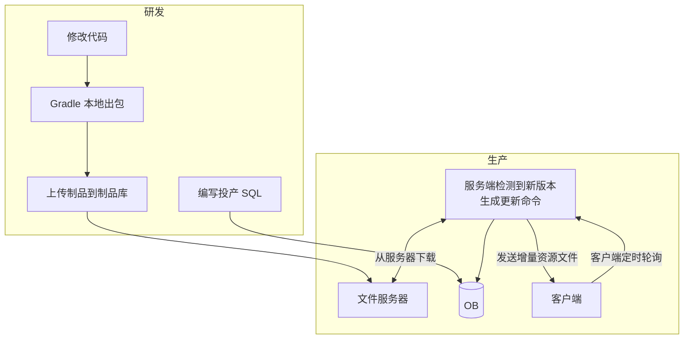
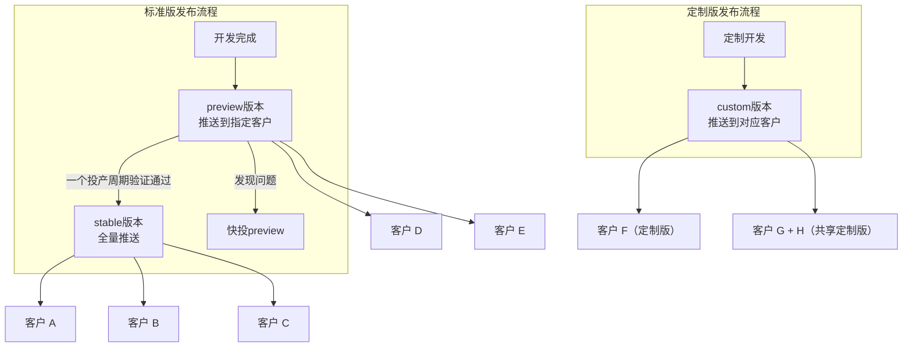
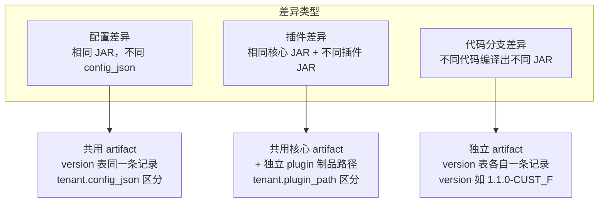
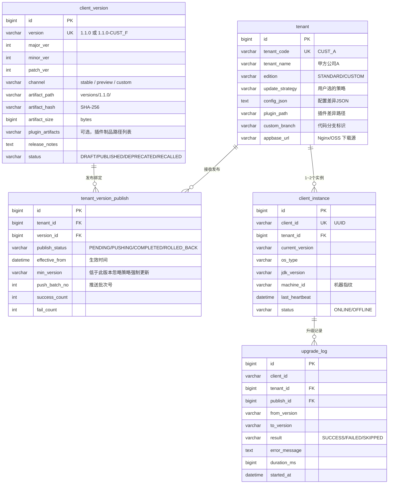
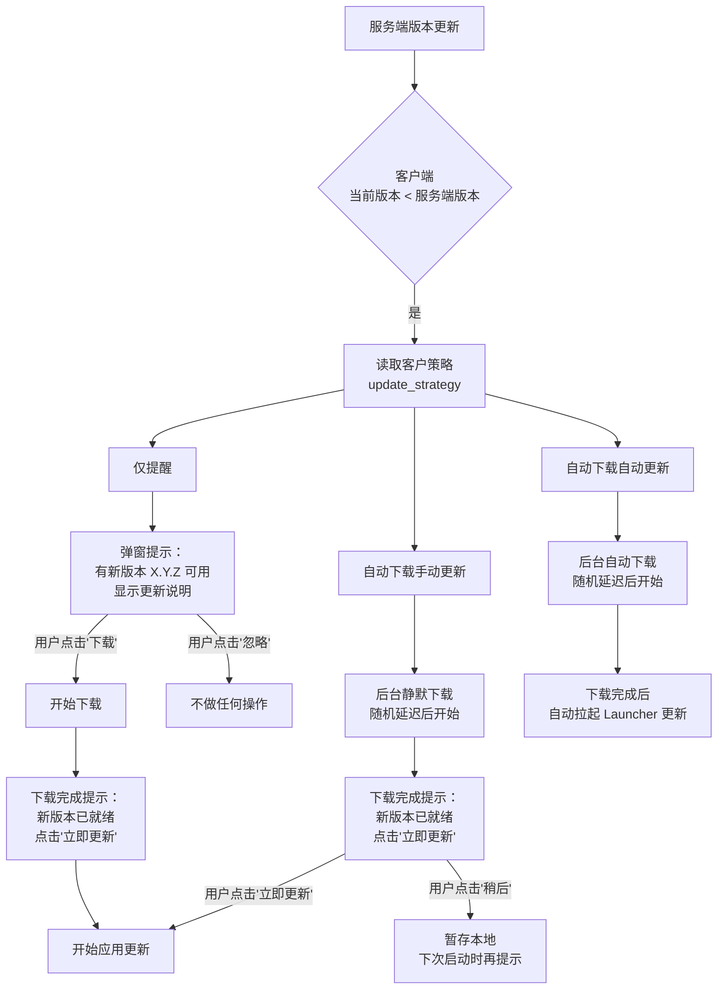
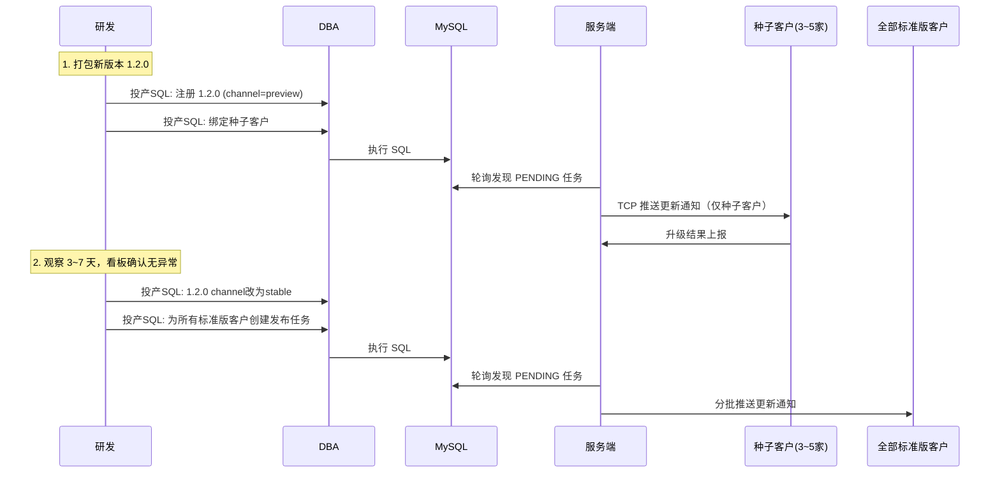
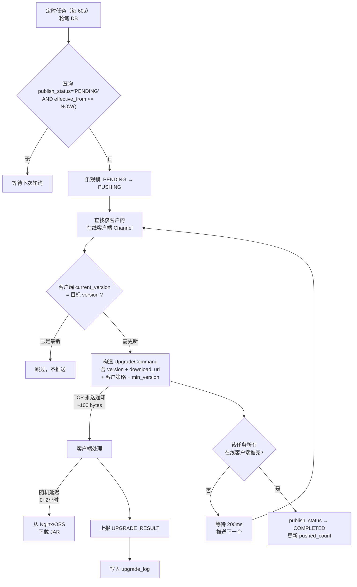
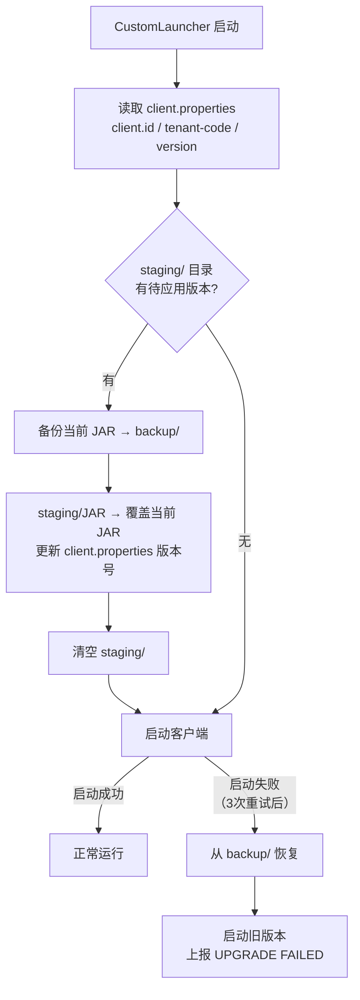
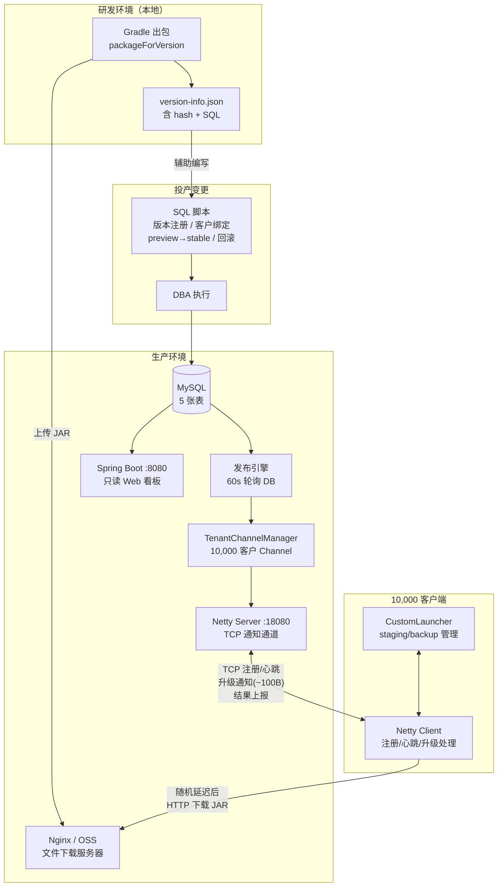

# 商业软件客户端版本管理体系与按需发布更新策略设计

基于现有 `nettydemo` 项目的 Getdown 升级框架，设计支持**定制版客户**、**按需发布**的版本管理与更新策略。

---

## 设计约束

| 约束 | 说明 |
|------|------|
| **客户与客户端** | ~10,000 客户，每客户 1~2 个客户端实例（近 1:1），共约 10,000~20,000 实例 |
| **版本类型** | 标准版（大部分客户共用）+ 定制版（部分客户独立 JAR） |
| **定制差异** | 三种并存：配置差异、插件差异、代码分支差异 |
| **出包方式** | 本地 Gradle 命令行出包，无 CI/CD |
| **数据库** | MySQL，所有生产变更通过**投产 SQL 脚本** |
| **文件托管** | 独立 Nginx 或 OSS，与应用服务器分离 |
| **带宽** | 应用服务器 3MB 单点（TCP 通知通道），文件下载走 Nginx/OSS |
| **Web UI** | 仅只读看板 |

---

## 一、运维全流程



> [!IMPORTANT]
> TCP 通知与文件下载**完全分离**。3MB 应用服务器只负责推送轻量通知报文（~100 bytes），实际的 JAR 文件下载走独立的 Nginx/OSS，不占用应用服务器带宽。

---

## 二、版本号与发布通道

### 2.1 版本号规范

```
{major}.{minor}.{patch}
```

### 2.2 发布通道模型



| 通道 | 说明 | 发布范围 |
|------|------|---------|
| `preview` | 预览版，推送到指定种子客户先行验证 | SQL 指定的客户列表 |
| `stable` | 正式版，验证通过后推送给所有标准版客户 | 所有使用标准版的客户 |
| `custom` | 定制版，一家一个或多家共用一个版本 | SQL 指定的客户 |

**灰度流程**就是：先发 preview 到几家种子客户 → 观察无问题 → 再通过投产 SQL 将该版本标记为 stable 推送全量。

---

## 三、定制版三种差异化支持

### 3.1 差异化模型



### 3.2 三种差异的打包方式

| 差异类型 | 打包方式 | 版本号示例 | 备注 |
|---------|---------|-----------|------|
| 配置差异 | 统一打标准版 JAR | `1.1.0` | 客户端启动时从 `config_json` 读取定制配置 |
| 插件差异 | 打标准版 JAR + 独立打插件 JAR | `1.1.0` + 插件独立版本 | 插件放在客户的 `plugin_path` 下 |
| 代码分支 | 切换分支后独立打包 | `1.1.0-CUST_F` | 客户绑定自己的 version 记录 |

```bash
# 打标准版
.\gradlew packageForVersion -PreleaseVersion=1.1.0

# 打定制版（代码分支差异）
git checkout branch-customer-f
.\gradlew packageForVersion -PreleaseVersion=1.1.0-CUST_F

# 打定制插件
.\gradlew :netty-plugin-client-demo:build
# 手动上传到 Nginx/OSS 的 plugins/CUST_F/ 目录
```

---

## 四、数据库设计

> [!NOTE]
> 10,000 客户 × 1~2 客户端，近 1:1 关系，不需要分表。所有数据在同一库内。

### 4.1 ER 关系图



### 4.2 完整建表 SQL

```sql
-- ============================================
-- 客户端版本管理体系 — 建表脚本
-- ============================================

-- 1. 版本注册表
CREATE TABLE client_version (
    id              BIGINT       PRIMARY KEY AUTO_INCREMENT,
    version         VARCHAR(50)  NOT NULL COMMENT '版本号: 1.1.0 或 1.1.0-CUST_F',
    major_ver       INT          NOT NULL,
    minor_ver       INT          NOT NULL,
    patch_ver       INT          NOT NULL,
    channel         VARCHAR(20)  NOT NULL DEFAULT 'stable' COMMENT 'stable/preview/custom',
    artifact_path   VARCHAR(500) NOT NULL COMMENT '制品在 Nginx/OSS 上的相对路径',
    artifact_hash   VARCHAR(64)  NOT NULL COMMENT 'SHA-256',
    artifact_size   BIGINT       NOT NULL DEFAULT 0 COMMENT 'bytes',
    plugin_artifacts VARCHAR(1000)         COMMENT '插件制品路径，逗号分隔（可选）',
    release_notes   TEXT                   COMMENT '更新说明',
    min_jdk_version VARCHAR(10)  NOT NULL DEFAULT '1.8',
    status          VARCHAR(20)  NOT NULL DEFAULT 'DRAFT' COMMENT 'DRAFT/PUBLISHED/DEPRECATED/RECALLED',
    created_at      DATETIME     NOT NULL DEFAULT CURRENT_TIMESTAMP,
    published_at    DATETIME,
    created_by      VARCHAR(50),
    UNIQUE KEY uk_version (version),
    INDEX idx_channel_status (channel, status)
) ENGINE=InnoDB DEFAULT CHARSET=utf8mb4 COMMENT='客户端版本注册表';

-- 2. 客户表
CREATE TABLE tenant (
    id              BIGINT       PRIMARY KEY AUTO_INCREMENT,
    tenant_code     VARCHAR(50)  NOT NULL COMMENT '客户编码',
    tenant_name     VARCHAR(100) NOT NULL COMMENT '客户名称',
    edition         VARCHAR(20)  NOT NULL DEFAULT 'STANDARD' COMMENT 'STANDARD-标准版 / CUSTOM-定制版',
    update_strategy VARCHAR(30)  NOT NULL DEFAULT 'NOTIFY_ONLY' COMMENT '更新策略: NOTIFY_ONLY / AUTO_DOWNLOAD / FULL_AUTO',
    config_json     TEXT                  COMMENT '配置差异 JSON（配置差异型定制）',
    plugin_path     VARCHAR(500)          COMMENT '客户专属插件目录路径（插件差异型定制）',
    custom_branch   VARCHAR(100)          COMMENT '定制代码分支标识（代码分支型定制）',
    appbase_url     VARCHAR(500)          COMMENT '文件下载源（Nginx/OSS），为空使用全局默认',
    status          VARCHAR(20)  NOT NULL DEFAULT 'ACTIVE',
    created_at      DATETIME     NOT NULL DEFAULT CURRENT_TIMESTAMP,
    updated_at      DATETIME     NOT NULL DEFAULT CURRENT_TIMESTAMP ON UPDATE CURRENT_TIMESTAMP,
    UNIQUE KEY uk_tenant_code (tenant_code)
) ENGINE=InnoDB DEFAULT CHARSET=utf8mb4 COMMENT='客户表';

-- 3. 发布任务表（投产 SQL 写入，服务端轮询执行）
CREATE TABLE tenant_version_publish (
    id              BIGINT       PRIMARY KEY AUTO_INCREMENT,
    tenant_id       BIGINT       NOT NULL,
    version_id      BIGINT       NOT NULL,
    publish_status  VARCHAR(20)  NOT NULL DEFAULT 'PENDING' COMMENT 'PENDING/PUSHING/COMPLETED/ROLLED_BACK',
    effective_from  DATETIME              COMMENT '生效时间（空=立即）',
    min_version     VARCHAR(50)           COMMENT '低于此版本时忽略客户策略，强制更新',
    push_batch_no   INT          NOT NULL DEFAULT 0 COMMENT '当前推送批次号',
    pushed_count    INT          NOT NULL DEFAULT 0,
    success_count   INT          NOT NULL DEFAULT 0,
    fail_count      INT          NOT NULL DEFAULT 0,
    created_at      DATETIME     NOT NULL DEFAULT CURRENT_TIMESTAMP,
    updated_at      DATETIME     NOT NULL DEFAULT CURRENT_TIMESTAMP ON UPDATE CURRENT_TIMESTAMP,
    FOREIGN KEY (tenant_id) REFERENCES tenant(id),
    FOREIGN KEY (version_id) REFERENCES client_version(id),
    UNIQUE KEY uk_tenant_version (tenant_id, version_id),
    INDEX idx_status (publish_status, effective_from)
) ENGINE=InnoDB DEFAULT CHARSET=utf8mb4 COMMENT='发布任务表';

-- 4. 客户端实例表
CREATE TABLE client_instance (
    id              BIGINT       PRIMARY KEY AUTO_INCREMENT,
    client_id       VARCHAR(64)  NOT NULL COMMENT 'UUID',
    tenant_id       BIGINT       NOT NULL,
    current_version VARCHAR(50)  NOT NULL,
    os_type         VARCHAR(20),
    os_version      VARCHAR(50),
    jdk_version     VARCHAR(20),
    machine_id      VARCHAR(100),
    last_heartbeat  DATETIME,
    last_upgrade_at DATETIME,
    status          VARCHAR(20)  NOT NULL DEFAULT 'OFFLINE',
    created_at      DATETIME     NOT NULL DEFAULT CURRENT_TIMESTAMP,
    updated_at      DATETIME     NOT NULL DEFAULT CURRENT_TIMESTAMP ON UPDATE CURRENT_TIMESTAMP,
    UNIQUE KEY uk_client_id (client_id),
    FOREIGN KEY (tenant_id) REFERENCES tenant(id),
    INDEX idx_tenant (tenant_id),
    INDEX idx_version (current_version)
) ENGINE=InnoDB DEFAULT CHARSET=utf8mb4 COMMENT='客户端实例表';

-- 5. 升级日志表
CREATE TABLE upgrade_log (
    id              BIGINT       PRIMARY KEY AUTO_INCREMENT,
    client_id       VARCHAR(64)  NOT NULL,
    tenant_id       BIGINT       NOT NULL,
    publish_id      BIGINT,
    from_version    VARCHAR(50)  NOT NULL,
    to_version      VARCHAR(50)  NOT NULL,
    strategy        VARCHAR(30)  NOT NULL COMMENT '实际使用的策略',
    result          VARCHAR(20)  NOT NULL COMMENT 'SUCCESS/FAILED/SKIPPED',
    error_message   TEXT,
    duration_ms     BIGINT,
    started_at      DATETIME     NOT NULL,
    completed_at    DATETIME,
    INDEX idx_client (client_id, started_at),
    INDEX idx_tenant (tenant_id, result),
    INDEX idx_publish (publish_id)
) ENGINE=InnoDB DEFAULT CHARSET=utf8mb4 COMMENT='升级日志表';
```

---

## 五、更新策略设计

### 5.1 三种策略（由客户/用户选择）

> [!IMPORTANT]
> 策略是**客户级别**的配置，存储在 `tenant.update_strategy` 字段中。代表该客户希望的更新行为。通过投产 SQL 设置，也可以由客户端用户在设置界面中选择（上报后更新 DB）。



### 5.2 策略对比

| 策略 | 含义 | 下载行为 | 安装行为 | 适用场景 |
|------|------|---------|---------|---------|
| **NOTIFY_ONLY** | 仅提醒 | 用户确认后才下载 | 用户手动触发 | 谨慎型客户，不希望自动操作 |
| **AUTO_DOWNLOAD** | 自动下载，手动更新 | 后台静默下载 | 用户确认后安装 | 多数客户，不影响工作 |
| **FULL_AUTO** | 全自动 | 后台静默下载 | 下载完自动安装 | 运维省心型客户 |

> [!NOTE]
> 特殊情况：当客户端当前版本 < 发布任务中的 `min_version` 时，无论客户选择了什么策略，都**强制下载 + 自动更新**。用于处理不兼容的协议变更或安全漏洞修复。

### 5.3 策略配置方式

- **初始设置**：通过投产 SQL 在 `tenant.update_strategy` 中配置
- **用户可调**：客户端提供设置界面，用户修改后通过 TCP 上报，服务端更新 `tenant.update_strategy`

---

## 六、Preview 版验证流程（替代灰度）

> [!NOTE]
> 由于生产参数不能随时调整，**不采用百分比灰度**。改用 **preview 通道** 机制：将新版本先推给指定的种子客户验证，通过后再转为 stable 全量推送。

### 6.1 流程



### 6.2 投产 SQL 示例

**Step 1：注册 preview 版 + 推给种子客户**

```sql
-- === 投产变更单：发布 v1.2.0 preview 到种子客户 ===

-- 注册 preview 版本
INSERT INTO client_version (version, major_ver, minor_ver, patch_ver,
    channel, artifact_path, artifact_hash, artifact_size,
    release_notes, status, published_at, created_by)
VALUES ('1.2.0', 1, 2, 0,
    'preview',
    'versions/1.2.0/',
    'SHA256_HASH_HERE',
    15728640,
    '1. 新增XX功能\n2. 修复YY问题',
    'PUBLISHED', NOW(), '张三');

-- 绑定到 3 个种子客户
INSERT INTO tenant_version_publish (tenant_id, version_id, publish_status, effective_from)
SELECT t.id,
    (SELECT id FROM client_version WHERE version = '1.2.0'),
    'PENDING', NOW()
FROM tenant t
WHERE t.tenant_code IN ('SEED_TENANT_1', 'SEED_TENANT_2', 'SEED_TENANT_3');
```

**Step 2：验证通过后，转为 stable 全量推送**

```sql
-- === 投产变更单：v1.2.0 preview → stable 全量发布 ===

-- 将版本通道改为 stable
UPDATE client_version SET channel = 'stable', updated_at = NOW()
WHERE version = '1.2.0';

-- 为所有标准版活跃客户（排除已有绑定的种子客户）创建发布任务
INSERT INTO tenant_version_publish (tenant_id, version_id, publish_status, effective_from)
SELECT t.id,
    (SELECT id FROM client_version WHERE version = '1.2.0'),
    'PENDING', NOW()
FROM tenant t
WHERE t.edition = 'STANDARD' AND t.status = 'ACTIVE'
  AND t.id NOT IN (
      SELECT tenant_id FROM tenant_version_publish
      WHERE version_id = (SELECT id FROM client_version WHERE version = '1.2.0')
  );
```

---

## 七、定制版投产 SQL 模板

### 7.1 一家一个定制版（代码分支差异）

```sql
-- === 投产变更单：客户 CUST_F 定制版 v1.1.0-CUST_F ===

INSERT INTO client_version (version, major_ver, minor_ver, patch_ver,
    channel, artifact_path, artifact_hash, artifact_size,
    release_notes, status, published_at, created_by)
VALUES ('1.1.0-CUST_F', 1, 1, 0, 'custom',
    'versions/1.1.0-CUST_F/',
    'SHA256_HASH', 16000000,
    'CUST_F 定制功能：XXX',
    'PUBLISHED', NOW(), '张三');

INSERT INTO tenant_version_publish (tenant_id, version_id, publish_status, effective_from)
VALUES (
    (SELECT id FROM tenant WHERE tenant_code = 'CUST_F'),
    (SELECT id FROM client_version WHERE version = '1.1.0-CUST_F'),
    'PENDING', NOW()
);
```

### 7.2 多家共用一个定制版

```sql
-- === 投产变更单：CUST_G + CUST_H 共用定制版 v1.1.0-GROUP_X ===

INSERT INTO client_version (version, major_ver, minor_ver, patch_ver,
    channel, artifact_path, artifact_hash, artifact_size,
    release_notes, status, published_at, created_by)
VALUES ('1.1.0-GROUP_X', 1, 1, 0, 'custom',
    'versions/1.1.0-GROUP_X/', 'SHA256_HASH', 15900000,
    'GROUP_X 定制版',
    'PUBLISHED', NOW(), '李四');

INSERT INTO tenant_version_publish (tenant_id, version_id, publish_status, effective_from)
SELECT t.id,
    (SELECT id FROM client_version WHERE version = '1.1.0-GROUP_X'),
    'PENDING', NOW()
FROM tenant t WHERE t.tenant_code IN ('CUST_G', 'CUST_H');
```

### 7.3 回滚

```sql
-- === 投产变更单：紧急回滚 CUST_A 到 v1.0.0 ===

-- 暂停当前任务
UPDATE tenant_version_publish
SET publish_status = 'ROLLED_BACK', updated_at = NOW()
WHERE tenant_id = (SELECT id FROM tenant WHERE tenant_code = 'CUST_A')
  AND version_id = (SELECT id FROM client_version WHERE version = '1.2.0');

-- 创建回滚任务
INSERT INTO tenant_version_publish (tenant_id, version_id, publish_status, effective_from)
VALUES (
    (SELECT id FROM tenant WHERE tenant_code = 'CUST_A'),
    (SELECT id FROM client_version WHERE version = '1.0.0'),
    'PENDING', NOW()
)
ON DUPLICATE KEY UPDATE
    publish_status = 'PENDING', updated_at = NOW();
```

### 7.4 新增客户

```sql
-- === 投产变更单：新增客户 + 绑定初始版本 ===

INSERT INTO tenant (tenant_code, tenant_name, edition, update_strategy,
    config_json, plugin_path, custom_branch, appbase_url)
VALUES (
    'CUST_NEW',
    'XX科技有限公司',
    'CUSTOM',                -- 或 'STANDARD'
    'AUTO_DOWNLOAD',         -- 默认自动下载手动更新
    '{"brand": "XX专版"}',   -- 配置差异（可选）
    'plugins/CUST_NEW/',     -- 插件路径（可选）
    'branch-cust-new',       -- 代码分支（可选）
    NULL                     -- 使用默认下载源
);

-- 绑定当前稳定版
INSERT INTO tenant_version_publish (tenant_id, version_id, publish_status, effective_from)
VALUES (
    (SELECT id FROM tenant WHERE tenant_code = 'CUST_NEW'),
    (SELECT id FROM client_version WHERE version = '1.0.0' AND status = 'PUBLISHED'),
    'PENDING', NOW()
);
```

---

## 八、服务端发布引擎

### 8.1 推送架构（适配 3MB 带宽）

> [!IMPORTANT]
> 应用服务器只推 TCP 通知报文（~100 bytes/条），不传输文件。即便 3MB 带宽，推送 10,000 条通知也仅需 ~1MB，毫无压力。真正的文件下载走 Nginx/OSS。



### 8.2 客户端下载错峰

由于 Nginx/OSS 也可能带宽有限，客户端收到通知后不立即下载，而是随机延迟：

```java
/**
 * 下载延迟策略：
 * - FULL_AUTO / AUTO_DOWNLOAD: 随机延迟 0~2小时后开始下载
 * - NOTIFY_ONLY: 用户点击下载时立即开始（无需延迟，因为是用户主动操作）
 * - 强制更新（version < min_version）: 随机延迟 0~10分钟
 */
int getDownloadJitterMs(String strategy, boolean isForced) {
    if (isForced) {
        return new Random().nextInt(10 * 60 * 1000);       // 0~10分钟
    }
    if ("NOTIFY_ONLY".equals(strategy)) {
        return 0;  // 用户主动触发，无需延迟
    }
    return new Random().nextInt(2 * 60 * 60 * 1000);       // 0~2小时
}
```

### 8.3 TenantChannelManager

```java
/**
 * 按客户管理 Channel（替代全局 activeChannels）。
 * 10,000 客户各 1~2 客户端，内存占用极小。
 */
public class TenantChannelManager {

    // tenantCode → 该客户的 Channel 集合（1~2个）
    private final ConcurrentMap<String, Set<Channel>> tenantChannels;
    // channel → 客户端注册信息
    private final ConcurrentMap<Channel, ClientInfo> channelRegistry;

    /** 客户端注册 */
    public void register(Channel ch, String tenantCode, String clientId, String version) { ... }
    /** 客户端断开 */
    public void unregister(Channel ch) { ... }
    /** 获取客户的所有在线 Channel */
    public Set<Channel> getChannels(String tenantCode) { ... }
    /** 获取所有在线客户端数 */
    public int onlineCount() { ... }
    /** 获取客户端当前版本 */
    public String getClientVersion(Channel ch) { ... }
}
```

---

## 九、Protobuf 协议扩展

```protobuf
syntax = "proto3";
package com.example.netty.common.proto;

option java_multiple_files = true;
option java_package = "com.example.netty.common.proto";
option java_outer_classname = "MessageProto";

enum MessageType {
  UNKNOWN = 0;
  PING = 1;
  PONG = 2;
  REQUEST = 3;
  RESPONSE = 4;
  UPGRADE = 5;
  CLIENT_REGISTER = 6;       // [NEW]
  UPGRADE_RESULT = 7;        // [NEW]
}

message Ping { int64 timestamp = 1; }
message Pong { int64 timestamp = 1; }
message Request { string reqId = 1; string command = 2; string data = 3; }
message Response { string reqId = 1; int32 code = 2; string message = 3; string data = 4; }

// [ENHANCED] 升级指令
message UpgradeCommand {
  string version = 1;
  string download_url = 2;         // Nginx/OSS 上的下载地址
  bool force = 3;                  // 保留兼容，true = version < min_version
  string update_strategy = 4;     // [NEW] NOTIFY_ONLY / AUTO_DOWNLOAD / FULL_AUTO
  string release_notes = 5;       // [NEW]
  int64 artifact_size = 6;        // [NEW] 文件大小，用于显示下载进度
  string artifact_hash = 7;       // [NEW] SHA-256
  string min_version = 8;         // [NEW] 最低版本（低于则强制）
  int32 jitter_max_seconds = 9;   // [NEW] 最大下载延迟秒数
  string plugin_download_urls = 10; // [NEW] 插件下载地址列表（逗号分隔）
}

// [NEW] 客户端注册
message ClientRegister {
  string client_id = 1;
  string tenant_code = 2;
  string current_version = 3;
  string os_type = 4;
  string os_version = 5;
  string jdk_version = 6;
  string machine_id = 7;
}

// [NEW] 升级结果上报
message UpgradeResult {
  string client_id = 1;
  string from_version = 2;
  string to_version = 3;
  bool success = 4;
  string error_message = 5;
  int64 duration_ms = 6;
}

message MessagePacket {
  MessageType type = 1;
  int64 sequence = 2;
  oneof payload {
    Ping ping = 3;
    Pong pong = 4;
    Request request = 5;
    Response response = 6;
    UpgradeCommand upgradeCommand = 7;
    ClientRegister clientRegister = 8;    // [NEW]
    UpgradeResult upgradeResult = 9;      // [NEW]
  }
}
```

---

## 十、客户端改造

### 10.1 本地目录结构

```
client-run-dir/
├── netty-client.jar              # 当前运行版本
├── getdown.txt                   # Getdown 配置
├── staging/                      # 已下载待应用版本
│   ├── netty-client.jar
│   └── version.txt
├── backup/                       # 上一版本备份
│   ├── netty-client.jar
│   └── version.txt
├── plugins/                      # 插件目录
│   └── *.jar
├── client.properties             # 身份配置
└── upgrade.state                 # 下载/延迟状态持久化
```

### 10.2 CustomLauncher 流程



### 10.3 策略处理流程（UpgradeClientPlugin 改造）

```java
@Override
public boolean handle(ChannelHandlerContext ctx, MessagePacket packet, String connType) {
    UpgradeCommand cmd = packet.getUpgradeCommand();
    String strategy = cmd.getUpdateStrategy();
    boolean isForced = isVersionLowerThan(currentVersion, cmd.getMinVersion());

    if (isForced) {
        // 版本过低，强制更新，短延迟后自动下载安装
        scheduleDownloadAndApply(cmd, getForceJitter());
        return true;
    }

    switch (strategy) {
        case "NOTIFY_ONLY":
            // 仅弹窗提醒，用户点击"下载"后才开始
            showNotification(cmd, /* onAccept */ () -> downloadAndPromptInstall(cmd));
            break;

        case "AUTO_DOWNLOAD":
            // 后台静默下载，完成后提示用户手动安装
            scheduleDownload(cmd, getJitter(), /* onComplete */ () -> showInstallPrompt(cmd));
            break;

        case "FULL_AUTO":
            // 后台下载，完成后自动安装
            scheduleDownloadAndApply(cmd, getJitter());
            break;
    }
    return true;
}
```

---

## 十一、Gradle 打包改造

### 11.1 打包命令

```powershell
# 打标准版
.\gradlew packageForVersion -PreleaseVersion=1.2.0

# 打定制版（先切换分支）
git checkout branch-cust-f
.\gradlew packageForVersion -PreleaseVersion=1.2.0-CUST_F
```

### 11.2 输出结构

```
build/upgrade-repository/versions/1.2.0/
├── netty-client.jar       # 应用 JAR
├── getdown.txt            # Getdown 配置
├── digest2.txt            # SHA-256 摘要
└── version-info.json      # 版本元信息 + SQL 模板
```

### 11.3 version-info.json 内容

```json
{
    "version": "1.2.0",
    "major": 1, "minor": 2, "patch": 0,
    "channel": "preview",
    "artifact_path": "versions/1.2.0/",
    "artifact_hash": "a1b2c3d4e5f6...",
    "artifact_size": 15728640,
    "build_time": "2026-06-03T00:00:00+08:00",
    "sql_register": "INSERT INTO client_version (version,major_ver,minor_ver,patch_ver,channel,artifact_path,artifact_hash,artifact_size,release_notes,status,published_at,created_by) VALUES ('1.2.0',1,2,0,'preview','versions/1.2.0/','a1b2c3d4e5f6...',15728640,'待填写','PUBLISHED',NOW(),'待填写');",
    "sql_publish_to_tenant": "INSERT INTO tenant_version_publish (tenant_id,version_id,publish_status,effective_from) VALUES ((SELECT id FROM tenant WHERE tenant_code='待填写'),(SELECT id FROM client_version WHERE version='1.2.0'),'PENDING',NOW());"
}
```

---

## 十二、Nginx/OSS 文件目录结构

```
/data/upgrade-repository/           # Nginx root 或 OSS bucket
├── versions/
│   ├── 1.0.0/
│   │   ├── netty-client.jar
│   │   ├── getdown.txt
│   │   └── digest2.txt
│   ├── 1.2.0/                       # 标准版
│   │   └── ...
│   ├── 1.1.0-CUST_F/                # 定制版
│   │   └── ...
│   └── 1.1.0-GROUP_X/               # 多家共用定制版
│       └── ...
└── plugins/
    ├── CUST_F/
    │   └── custom-plugin.jar
    └── CUST_G/
        └── another-plugin.jar
```

客户端 `download_url` 示例：`https://oss.example.com/versions/1.2.0/netty-client.jar`

---

## 十三、Web 只读看板

### 13.1 功能（全部只读）

| 页面 | 内容 |
|------|------|
| **版本列表** | 所有已注册版本、通道、状态、发布时间 |
| **客户列表** | 客户编码/名称、版本类型、当前策略、绑定版本 |
| **发布任务** | 各任务状态、推送/成功/失败计数 |
| **客户端在线状态** | 在线/离线、当前版本、最后心跳、OS/JDK 信息 |
| **版本分布饼图** | 各版本的客户端数量占比 |
| **升级日志** | 按时间/客户/结果筛选升级记录 |

### 13.2 技术方案

嵌入 Spring Boot，使用 Thymeleaf 模板 + 简单的 Chart.js 图表。仅通过 `SELECT` 查询 DB，无任何写入操作。

---

## 十四、整体架构图



---

## Open Questions

> [!IMPORTANT]
> **客户端首次安装**：新客户的客户端首次安装包如何分发？
> - A. 线下提供安装包，内含预置的 `client.properties`（tenant_code 已填好）
> - B. 统一安装器，首次启动时用户输入客户编码
> - C. 其他方式？

---

## Proposed Changes

分 5 个阶段，按依赖顺序实施：

### 阶段一：基础设施（协议 + 数据库）

#### [NEW] [schema.sql](file:///d:/Projects/code/nettydemo/docs/schema.sql)
- 5 张表建表语句 + 初始数据

#### [NEW] [sql_templates.sql](file:///d:/Projects/code/nettydemo/docs/sql_templates.sql)
- 全套投产 SQL 模板：注册版本、preview 发布、stable 全量、定制版、回滚、新增客户

#### [MODIFY] [message.proto](file:///d:/Projects/code/nettydemo/netty-common/src/main/proto/message.proto)
- 新增 `CLIENT_REGISTER`、`UPGRADE_RESULT` 消息
- 增强 `UpgradeCommand`（策略、hash、jitter、插件 URL）

---

### 阶段二：服务端核心

#### [NEW] `TenantChannelManager.java` — 按客户管理 Channel
#### [NEW] `PublishEngine.java` — DB 轮询 + 分发引擎
#### [NEW] `ClientRegisterServerPlugin.java` — 处理客户端注册，写 DB
#### [NEW] `UpgradeResultServerPlugin.java` — 处理升级结果上报，写 upgrade_log
#### [MODIFY] [UpgradeController.java](file:///d:/Projects/code/nettydemo/netty-server/src/main/java/com/example/netty/server/controller/UpgradeController.java) — 改为只读查询

---

### 阶段三：客户端改造

#### [MODIFY] [CustomLauncher.java](file:///d:/Projects/code/nettydemo/netty-client-upgrade/src/main/java/com/example/netty/upgrade/CustomLauncher.java)
- `client.properties` 读写 + staging/backup 目录管理

#### [MODIFY] [UpgradeClientPlugin.java](file:///d:/Projects/code/nettydemo/netty-client/src/main/java/com/example/netty/client/plugin/UpgradeClientPlugin.java)
- 三种策略处理 + 随机延迟下载 + 结果上报

#### [NEW] `ClientRegisterPlugin.java` — 连接建立后发送注册

---

### 阶段四：Gradle 出包

#### [MODIFY] [build.gradle](file:///d:/Projects/code/nettydemo/netty-client-upgrade/build.gradle)
- `packageForVersion` 任务 + `version-info.json` 生成

---

### 阶段五：Web 只读看板

#### [NEW] Thymeleaf 页面 — 版本/客户/客户端/日志只读看板

---

## Verification Plan

### Automated Tests
1. Protobuf 序列化/反序列化
2. 版本号比较
3. PublishEngine 轮询逻辑

### Manual Verification
1. 本地出包，验证 `version-info.json` 正确
2. 执行投产 SQL → 服务端 60s 内拾取 → 推送到指定客户
3. preview 推送种子客户 → 转 stable 全量推送
4. 三种策略（NOTIFY_ONLY / AUTO_DOWNLOAD / FULL_AUTO）的客户端行为
5. 升级失败 → backup 自动回滚
6. 回滚 SQL → 客户端收到降级通知
