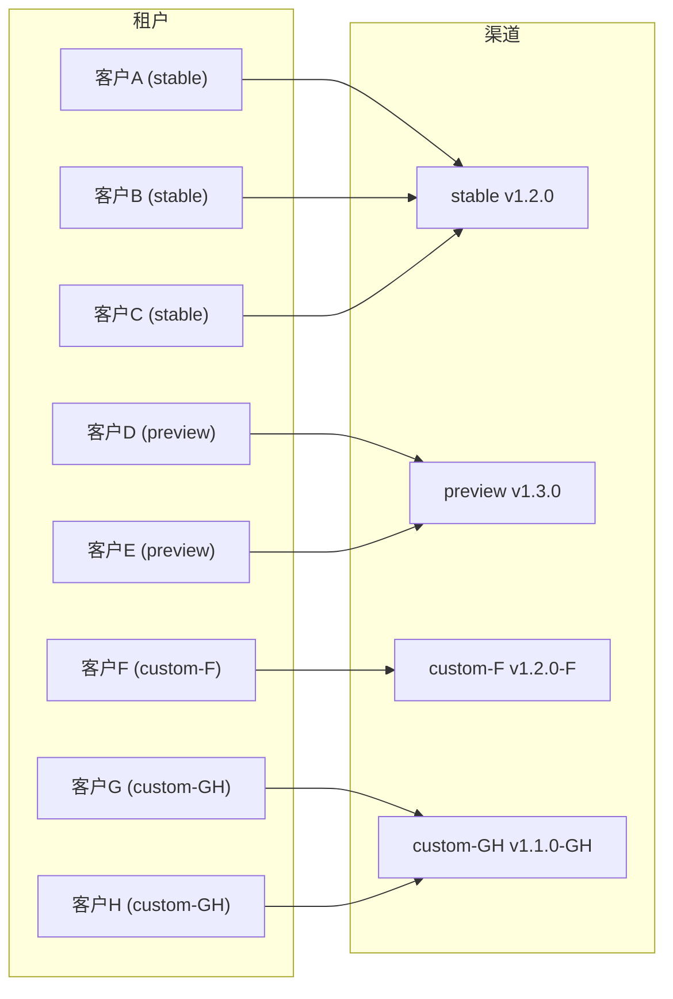
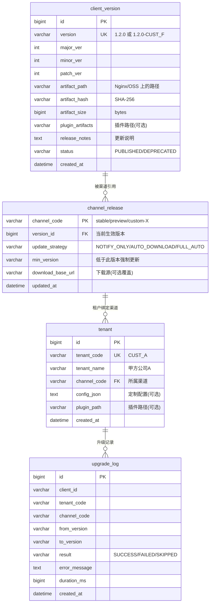
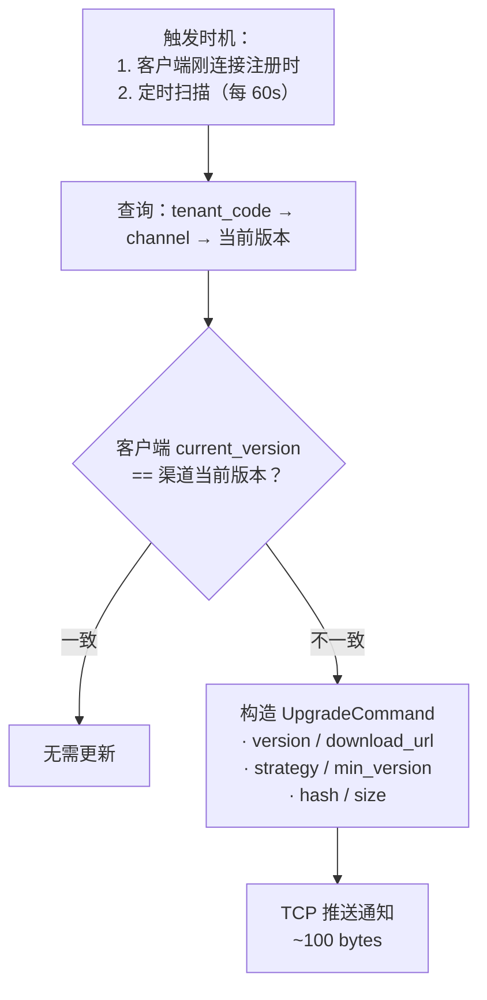
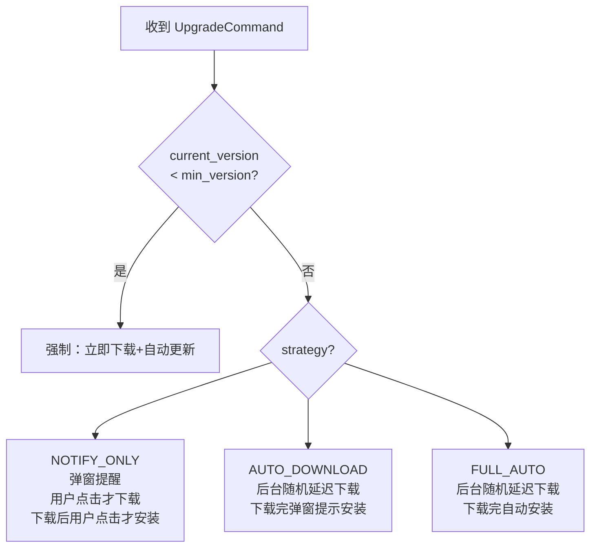
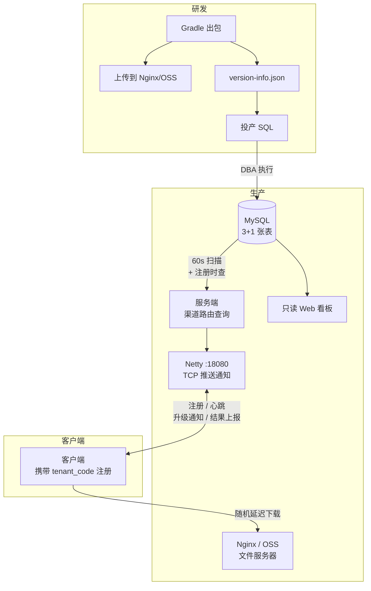

# 商业软件客户端版本管理体系与按需发布设计

基于 Getdown 升级框架，采用**渠道路由**模型实现按需发布。

---

## 核心思路

```
客户端携带 tenant_code 连接 → 服务端查 tenant 表得到 channel → 查 channel_release 得到当前版本 → 版本不一致则推送通知
```

**发布 = 一条 UPDATE SQL**，将渠道指向新版本，服务端自动发现并推送。

---

## 一、渠道路由模型



| 概念 | 说明 |
|------|------|
| **渠道 (channel)** | 一个版本发布通道，如 `stable`、`preview`、`custom-CUST_F` |
| **渠道当前版本** | 每个渠道指向一个当前生效版本（`channel_release` 表） |
| **租户绑定渠道** | 每个租户属于一个渠道（`tenant.channel_code`） |
| **路由** | 客户端连接带 `tenant_code` → 查租户的 `channel_code` → 查该渠道当前版本 → 比对推送 |

---

## 二、数据库设计（3 + 1 张表）

### 2.1 ER 图



### 2.2 建表 SQL

```sql
-- ============================================
-- 客户端版本管理 — 建表脚本（3 + 1 张表）
-- ============================================

-- 1. 版本表：注册所有历史版本
CREATE TABLE client_version (
    id              BIGINT       PRIMARY KEY AUTO_INCREMENT,
    version         VARCHAR(50)  NOT NULL COMMENT '版本号',
    major_ver       INT          NOT NULL,
    minor_ver       INT          NOT NULL,
    patch_ver       INT          NOT NULL,
    artifact_path   VARCHAR(500) NOT NULL COMMENT 'Nginx/OSS 相对路径，如 versions/1.2.0/',
    artifact_hash   VARCHAR(64)  NOT NULL COMMENT 'JAR SHA-256',
    artifact_size   BIGINT       NOT NULL DEFAULT 0,
    plugin_artifacts VARCHAR(1000)         COMMENT '插件制品路径，逗号分隔',
    release_notes   TEXT,
    status          VARCHAR(20)  NOT NULL DEFAULT 'PUBLISHED' COMMENT 'PUBLISHED/DEPRECATED',
    created_at      DATETIME     NOT NULL DEFAULT CURRENT_TIMESTAMP,
    created_by      VARCHAR(50),
    UNIQUE KEY uk_version (version)
) ENGINE=InnoDB DEFAULT CHARSET=utf8mb4 COMMENT='版本注册表';

-- 2. 渠道发布表：每个渠道指向一个当前版本（核心路由表）
CREATE TABLE channel_release (
    channel_code    VARCHAR(50)  PRIMARY KEY COMMENT '渠道编码: stable/preview/custom-X',
    version_id      BIGINT       NOT NULL COMMENT '当前生效版本',
    update_strategy VARCHAR(30)  NOT NULL DEFAULT 'NOTIFY_ONLY' COMMENT 'NOTIFY_ONLY/AUTO_DOWNLOAD/FULL_AUTO',
    min_version     VARCHAR(50)           COMMENT '最低版本，低于此版本忽略策略强制更新',
    download_base_url VARCHAR(500)        COMMENT '下载源URL（覆盖全局默认）',
    updated_at      DATETIME     NOT NULL DEFAULT CURRENT_TIMESTAMP ON UPDATE CURRENT_TIMESTAMP,
    FOREIGN KEY (version_id) REFERENCES client_version(id)
) ENGINE=InnoDB DEFAULT CHARSET=utf8mb4 COMMENT='渠道发布表 — 发布=UPDATE此表';

-- 3. 租户表：每个租户绑定一个渠道
CREATE TABLE tenant (
    id              BIGINT       PRIMARY KEY AUTO_INCREMENT,
    tenant_code     VARCHAR(50)  NOT NULL COMMENT '租户编码',
    tenant_name     VARCHAR(100) NOT NULL,
    channel_code    VARCHAR(50)  NOT NULL COMMENT '所属渠道',
    config_json     TEXT                  COMMENT '租户定制配置',
    plugin_path     VARCHAR(500)          COMMENT '租户专属插件路径',
    created_at      DATETIME     NOT NULL DEFAULT CURRENT_TIMESTAMP,
    UNIQUE KEY uk_tenant_code (tenant_code),
    FOREIGN KEY (channel_code) REFERENCES channel_release(channel_code)
) ENGINE=InnoDB DEFAULT CHARSET=utf8mb4 COMMENT='租户表';

-- 4. 升级日志（审计）
CREATE TABLE upgrade_log (
    id              BIGINT       PRIMARY KEY AUTO_INCREMENT,
    client_id       VARCHAR(64)  NOT NULL,
    tenant_code     VARCHAR(50)  NOT NULL,
    channel_code    VARCHAR(50)  NOT NULL,
    from_version    VARCHAR(50)  NOT NULL,
    to_version      VARCHAR(50)  NOT NULL,
    result          VARCHAR(20)  NOT NULL,
    error_message   TEXT,
    duration_ms     BIGINT,
    created_at      DATETIME     NOT NULL DEFAULT CURRENT_TIMESTAMP,
    INDEX idx_tenant (tenant_code),
    INDEX idx_time (created_at)
) ENGINE=InnoDB DEFAULT CHARSET=utf8mb4 COMMENT='升级日志';
```

### 2.3 初始化数据

```sql
-- 注册初始版本
INSERT INTO client_version (version, major_ver, minor_ver, patch_ver,
    artifact_path, artifact_hash, artifact_size, release_notes, created_by)
VALUES ('1.0.0', 1, 0, 0, 'versions/1.0.0/',
    'INITIAL_HASH', 15000000, '初始版本', 'admin');

-- 创建渠道
INSERT INTO channel_release (channel_code, version_id, update_strategy) VALUES
('stable',  1, 'NOTIFY_ONLY'),
('preview', 1, 'NOTIFY_ONLY');

-- 注册租户
INSERT INTO tenant (tenant_code, tenant_name, channel_code) VALUES
('CUST_A', '甲方公司A', 'stable'),
('CUST_B', '乙方公司B', 'stable'),
('SEED_1', '种子客户1', 'preview');
```

---

## 三、发布操作（全靠 SQL）

### 3.1 发新版到 preview（种子租户先用）

```sql
-- Step 1: 注册版本
INSERT INTO client_version (version, major_ver, minor_ver, patch_ver,
    artifact_path, artifact_hash, artifact_size, release_notes, created_by)
VALUES ('1.2.0', 1, 2, 0, 'versions/1.2.0/',
    'SHA256_HASH', 15728640, '新功能XX', '张三');

-- Step 2: preview 渠道指向新版本（一条 UPDATE 完成发布）
UPDATE channel_release
SET version_id = (SELECT id FROM client_version WHERE version = '1.2.0'),
    updated_at = NOW()
WHERE channel_code = 'preview';
```

### 3.2 preview 验证通过 → stable 全量

```sql
-- stable 渠道指向同一版本
UPDATE channel_release
SET version_id = (SELECT id FROM client_version WHERE version = '1.2.0'),
    updated_at = NOW()
WHERE channel_code = 'stable';
```

### 3.3 发定制版

```sql
-- 注册定制版本
INSERT INTO client_version (version, major_ver, minor_ver, patch_ver,
    artifact_path, artifact_hash, artifact_size, release_notes, created_by)
VALUES ('1.2.0-CUST_F', 1, 2, 0, 'versions/1.2.0-CUST_F/',
    'SHA256_HASH', 16000000, 'CUST_F 定制功能', '李四');

-- 创建定制渠道 + 指向版本（首次）
INSERT INTO channel_release (channel_code, version_id, update_strategy)
VALUES ('custom-CUST_F',
    (SELECT id FROM client_version WHERE version = '1.2.0-CUST_F'),
    'AUTO_DOWNLOAD');

-- 租户绑定到定制渠道
UPDATE tenant SET channel_code = 'custom-CUST_F' WHERE tenant_code = 'CUST_F';
```

### 3.4 多家共享定制渠道

```sql
-- 创建共享定制渠道
INSERT INTO channel_release (channel_code, version_id, update_strategy)
VALUES ('custom-GROUP_X',
    (SELECT id FROM client_version WHERE version = '1.1.0-GROUP_X'),
    'NOTIFY_ONLY');

-- 多个租户绑定同一渠道
UPDATE tenant SET channel_code = 'custom-GROUP_X'
WHERE tenant_code IN ('CUST_G', 'CUST_H');
```

### 3.5 回滚

```sql
-- 渠道指回旧版本
UPDATE channel_release
SET version_id = (SELECT id FROM client_version WHERE version = '1.0.0'),
    updated_at = NOW()
WHERE channel_code = 'stable';
```

### 3.6 强制最低版本

```sql
-- 设置 stable 渠道最低版本（低于此版本的客户端将忽略策略强制更新）
UPDATE channel_release
SET min_version = '1.1.0',
    updated_at = NOW()
WHERE channel_code = 'stable';
```

### 3.7 修改渠道策略

```sql
UPDATE channel_release SET update_strategy = 'FULL_AUTO' WHERE channel_code = 'stable';
```

### 3.8 新增租户

```sql
INSERT INTO tenant (tenant_code, tenant_name, channel_code)
VALUES ('CUST_NEW', 'XX科技', 'stable');
```

---

## 四、服务端路由逻辑

### 4.1 核心查询（单条 SQL）

```sql
-- 根据 tenant_code 查询该租户应使用的版本
SELECT cv.version, cv.artifact_path, cv.artifact_hash, cv.artifact_size,
       cv.plugin_artifacts, cv.release_notes,
       cr.update_strategy, cr.min_version, cr.download_base_url,
       cr.channel_code
FROM tenant t
JOIN channel_release cr ON cr.channel_code = t.channel_code
JOIN client_version cv ON cv.id = cr.version_id
WHERE t.tenant_code = ?;
```

### 4.2 服务端推送流程



**两个触发点**：

1. **客户端注册时**（`CLIENT_REGISTER`）：客户端刚上线，服务端立即查渠道版本比对，不一致则推送。这是最主要的触发方式。
2. **定时扫描**（每 60s）：遍历所有在线客户端，重新比对。用于覆盖"SQL 更新 channel_release 后、已在线客户端"的场景。

```java
/**
 * 版本检查：对单个客户端执行渠道路由 + 版本比对
 */
public void checkAndPush(Channel channel, ClientInfo clientInfo) {
    // 1. 查询该租户的渠道当前版本
    ChannelVersionInfo info = versionDao.queryByTenant(clientInfo.getTenantCode());
    if (info == null) return;

    // 2. 比对
    if (info.getVersion().equals(clientInfo.getCurrentVersion())) return;

    // 3. 构造通知
    UpgradeCommand cmd = buildUpgradeCommand(info, clientInfo);
    channel.writeAndFlush(wrapPacket(cmd));
}

/**
 * 定时扫描：每 60s 检查所有在线客户端
 */
@Scheduled(fixedDelay = 60_000)
public void scanOnlineClients() {
    for (Map.Entry<Channel, ClientInfo> entry : channelManager.allClients()) {
        checkAndPush(entry.getKey(), entry.getValue());
    }
}
```

> [!NOTE]
> 这样就不需要复杂的发布引擎了。DBA 执行 `UPDATE channel_release` 后，最多 60 秒内，服务端扫描就会发现版本不一致并推送通知。

---

## 五、更新策略

### 5.1 三种策略（渠道级配置）



| 策略 | 下载 | 安装 | 用户感知 |
|------|------|------|---------|
| `NOTIFY_ONLY` | 用户确认后 | 用户确认后 | 两次确认 |
| `AUTO_DOWNLOAD` | 后台自动（延迟） | 用户确认后 | 只确认安装 |
| `FULL_AUTO` | 后台自动（延迟） | 自动 | 无感知 |

### 5.2 下载延迟（错峰）

```java
// AUTO_DOWNLOAD / FULL_AUTO：随机延迟 0~2小时
int jitterMs = new Random().nextInt(2 * 60 * 60 * 1000);
// 强制更新：随机延迟 0~10分钟
int forceJitterMs = new Random().nextInt(10 * 60 * 1000);
// NOTIFY_ONLY：用户点击后立即开始，无需延迟
```

---

## 六、Protobuf 协议扩展

在 [message.proto](file:///d:/Projects/code/nettydemo/netty-common/src/main/proto/message.proto) 基础上增加：

```protobuf
enum MessageType {
  UNKNOWN = 0;
  PING = 1;
  PONG = 2;
  REQUEST = 3;
  RESPONSE = 4;
  UPGRADE = 5;
  CLIENT_REGISTER = 6;     // [NEW]
  UPGRADE_RESULT = 7;      // [NEW]
}

// [ENHANCED]
message UpgradeCommand {
  string version = 1;
  string download_url = 2;
  bool force = 3;                  // true 当 current < min_version
  string update_strategy = 4;     // NOTIFY_ONLY / AUTO_DOWNLOAD / FULL_AUTO
  string release_notes = 5;
  int64 artifact_size = 6;
  string artifact_hash = 7;
  string min_version = 8;
  int32 jitter_max_seconds = 9;
  string plugin_download_urls = 10;
  string channel_code = 11;       // 告知客户端所属渠道
}

// [NEW]
message ClientRegister {
  string client_id = 1;
  string tenant_code = 2;        // 路由关键字段
  string current_version = 3;
  string os_type = 4;
  string os_version = 5;
  string jdk_version = 6;
  string machine_id = 7;
}

// [NEW]
message UpgradeResult {
  string client_id = 1;
  string from_version = 2;
  string to_version = 3;
  bool success = 4;
  string error_message = 5;
  int64 duration_ms = 6;
}

message MessagePacket {
  MessageType type = 1;
  int64 sequence = 2;
  oneof payload {
    Ping ping = 3;
    Pong pong = 4;
    Request request = 5;
    Response response = 6;
    UpgradeCommand upgradeCommand = 7;
    ClientRegister clientRegister = 8;
    UpgradeResult upgradeResult = 9;
  }
}
```

---

## 七、客户端

### 7.1 `client.properties`

```properties
client.id=550e8400-e29b-41d4-a716-446655440000
client.tenant-code=CUST_A
client.current-version=1.0.0
```

### 7.2 连接注册

客户端建立 TCP 连接后发送 `CLIENT_REGISTER`（含 `tenant_code` + `current_version`），服务端据此路由查版本并推送。

### 7.3 本地 staging/backup

```
client-run-dir/
├── netty-client.jar          # 当前版本
├── staging/                  # 已下载待安装
│   ├── netty-client.jar
│   └── version.txt
├── backup/                   # 上一版本（回滚用）
│   ├── netty-client.jar
│   └── version.txt
└── client.properties
```

CustomLauncher 启动时：检查 `staging/` → 有则备份当前到 `backup/` → 应用 staging → 启动；启动失败则从 `backup/` 恢复。

---

## 八、Gradle 出包

```powershell
.\gradlew packageForVersion -PreleaseVersion=1.2.0
```

输出：
```
build/upgrade-repository/versions/1.2.0/
├── netty-client.jar
├── getdown.txt
├── digest2.txt
└── version-info.json    # 含 hash/size/SQL 模板
```

`version-info.json` 自动生成 SQL 模板，拷贝即可作为投产 SQL 的基础。

---

## 九、整体架构



---

## Proposed Changes

### 阶段一：基础设施

#### [NEW] [schema.sql](file:///d:/Projects/code/nettydemo/docs/schema.sql)
- 3+1 张表建表 + 初始数据

#### [NEW] [sql_templates.sql](file:///d:/Projects/code/nettydemo/docs/sql_templates.sql)
- 投产 SQL 模板（发版/preview→stable/定制版/回滚/新租户）

#### [MODIFY] [message.proto](file:///d:/Projects/code/nettydemo/netty-common/src/main/proto/message.proto)
- 新增 `CLIENT_REGISTER` / `UPGRADE_RESULT`，增强 `UpgradeCommand`

---

### 阶段二：服务端

#### [NEW] `TenantChannelManager.java` — 按租户管理 Channel
#### [NEW] `VersionRouter.java` — 渠道路由查询 + 定时扫描 + 推送通知
#### [NEW] `ClientRegisterServerPlugin.java` — 处理注册，触发版本检查
#### [NEW] `UpgradeResultServerPlugin.java` — 处理结果上报，写 upgrade_log
#### [MODIFY] [UpgradeController.java](file:///d:/Projects/code/nettydemo/netty-server/src/main/java/com/example/netty/server/controller/UpgradeController.java) — 改为只读查询

---

### 阶段三：客户端

#### [MODIFY] [CustomLauncher.java](file:///d:/Projects/code/nettydemo/netty-client-upgrade/src/main/java/com/example/netty/upgrade/CustomLauncher.java) — staging/backup 管理
#### [MODIFY] [UpgradeClientPlugin.java](file:///d:/Projects/code/nettydemo/netty-client/src/main/java/com/example/netty/client/plugin/UpgradeClientPlugin.java) — 三策略处理 + 延迟下载 + 结果上报
#### [NEW] `ClientRegisterPlugin.java` — 连接后发送注册

---

### 阶段四：Gradle 出包

#### [MODIFY] [build.gradle](file:///d:/Projects/code/nettydemo/netty-client-upgrade/build.gradle) — `packageForVersion` + `version-info.json`

---

## Verification Plan

### Manual Verification
1. 出包 → 上传 → 执行 SQL → 60s 内客户端收到通知
2. preview 渠道推送种子租户 → UPDATE 改 stable → 全量收到
3. 三种策略行为验证
4. 回滚 SQL → 客户端降级
5. 升级失败 → backup 恢复
